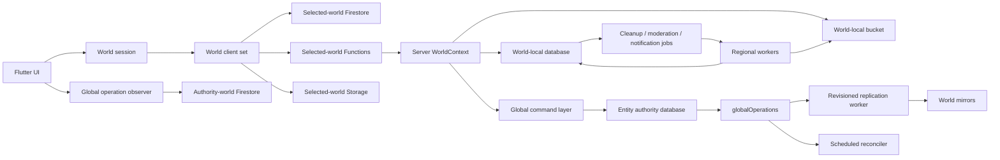

# Firestore multi-world implementation plan

## Status

- Status: draft for review
- Source design:
  `internal-docs/design/global-consistency-server-operations.md`
- Planning baseline: `8a4110b`
- Current production mapping: `asia -> (default) -> asia-northeast1`
- Target initial worlds: `asia`, `northAmerica`, and `europe`
- Firestore edition: Standard

This plan converts the approved consistency design into reviewable,
independently deployable work. It deliberately avoids a big-bang rewrite.
Every stage must preserve the current Asia-only behavior until its activation
gate is explicitly opened.

## Outcome

When this plan is complete:

- notes, messages, memberships, visits, likes, reports, moderation queues, and
  other regional content are isolated in the selected world's database;
- each user has one immutable `homeWorld` for private account authority;
- profiles, social edges, block state, entitlements, and account-safety state
  have one distributed authority and revisioned mirrors;
- regional interaction paths consult local enforcement mirrors and do not add
  routine cross-region reads;
- global writes return `accepted` after the authority commit and expose
  server-authoritative completion through `globalOperations`; only workflows
  that need user- or administrator-visible progress start durable client
  observation;
- Firestore, Storage, Functions, indexes, Rules, workers, monitoring, and
  cleanup are provisioned as one world bundle;
- optimistic moderation, notification delivery, and cleanup are durable,
  observable asynchronous workflows;
- another world can be added without adding a new branch to every repository
  or handler.

## Non-goals

The initial implementation will not:

- move a user's immutable home authority after assignment;
- move a note or message between worlds;
- provide a single all-world note feed or all-world managed-note list;
- provide synchronous cross-database transactions;
- promise exactly-once Functions, FCM, or Storage side effects;
- add a general private-note invitation system;
- shard popular counters before measurements demonstrate a hotspot;
- delete or relocate existing production data as part of infrastructure setup.

## Validated platform assumptions

The implementation relies on the following current platform behavior:

- Firebase projects support multiple Firestore databases, and client libraries
  select a named database when constructing the client:
  <https://firebase.google.com/docs/firestore/manage-databases>
- FlutterFire `cloud_firestore` 6.6.0 already exposes
  `FirebaseFirestore.instanceFor(app:, databaseId:)`.
- Cloud Functions v2 Firestore triggers accept a `database` option, but each
  trigger is attached to exactly one database:
  <https://firebase.google.com/docs/functions/firestore-events>
- `firebase.json` accepts one Firestore entry per database, with independently
  deployable Rules and indexes:
  <https://firebase.google.com/docs/cli#configuration_for_multiple_cloud_firestore_databases>
- the Firestore emulator creates configured named databases, but does not
  enforce composite indexes and its UI has limited named-database support:
  <https://firebase.google.com/docs/emulator-suite/connect_firestore>

**Decided with explicit risk acceptance:** use Firebase Admin Node's
named-database `getFirestore(databaseId)` overload in production even while
the current reference labels it Preview and advises against production use.
Named-database construction must remain confined to
`WorldFirestoreProvider`; business handlers must receive a `Firestore`
instance and must not import or call the overload directly. Pin the exact
Firebase Admin version, validate every upgrade in emulator and staging, and
retain `new Firestore({projectId, databaseId})` from the stable
`@google-cloud/firestore` server client as the documented replacement path if
the Preview surface changes or regresses. This accepts SDK-surface risk, not
weaker data-consistency, retry, or observability requirements.

Required production controls:

- pin `firebase-admin` to an exact reviewed version and prohibit unattended
  dependency updates;
- accept only catalog allowlisted database IDs, cache one client per database,
  and assert that the returned client's `databaseId` equals the requested
  world catalog entry before any operation;
- run read, write, transaction, batch, query, trigger, and cross-database
  replication contract tests against every staging database before an SDK
  upgrade or world activation;
- expose per-world read and write enablement switches so a faulty named
  database route can be disabled without taking Asia offline;
- label errors, latency, retries, and operation backlog by world and database
  ID, with alerts for route mismatch, `NOT_FOUND`, permission, and transaction
  regressions;
- keep the stable Google Cloud server-client adapter buildable and covered by
  the same contract suite so an emergency replacement does not require
  business-handler changes.

## Pre-migration findings

### Client

- `firestoreProvider` always returns `FirebaseFirestore.instance`.
- `firebaseStorageProvider` always returns the default bucket.
- Functions routing currently chooses the nearest available Functions region,
  but does not select a matching Firestore database or Storage bucket.
- region selection follows current location automatically. The approved design
  instead requires an explicit, persistent `selectedWorld`.
- account creation, public-profile synchronization, and some profile reads
  write or read the default database directly.
- note and message repositories retain one Firestore, Functions, and Storage
  instance for their entire lifetime.
- routes and entities generally identify content only by `placeId`; a
  cross-world identity must include `worldId`.

### Functions

- every handler uses the default `getFirestore()` client.
- every image path uses the default `getStorage().bucket()`.
- all callable and scheduled functions are deployed only in
  `asia-northeast1`.
- most business handlers construct their own Firebase clients, making routing
  difficult to test or enforce centrally.
- asynchronous notification and Storage work is still best effort in several
  paths.
- the current single Firestore trigger does not specify a database.

### Rules, indexes, and infrastructure

- `firebase.json` contains one Firestore configuration and one Storage Rules
  configuration.
- `.firebaserc` has no multi-bucket deploy targets.
- `firestore.rules` and `firestore.indexes.json` assume one database.
- direct Storage reads are allowed to any authenticated user; the approved
  design requires server-authorized signed downloads.
- there is no checked-in infrastructure definition for databases, buckets,
  delete protection, TTL policies, IAM, alerts, or catalog activation.

### Tests and CI

- the current baseline passes `flutter analyze`, 134 Flutter tests,
  Functions lint/build, and 22 Functions tests.
- the Android workflow does not run Functions checks.
- Functions tests are mostly pure unit tests; no emulator test currently
  validates multi-database transactions, triggers, or retry behavior.
- no automated Firestore Rules attack suite exists.
- the emulator cannot prove composite-index readiness, so a staging deployment
  test is required before catalog activation.

## Architectural boundaries



The UI and domain repositories must not construct raw Firebase clients.
Functions business handlers must not call `getFirestore()` or
`getStorage().bucket()` directly. Those two rules are the main mechanism for
hiding multi-world complexity.

## World catalog and routing kernel

### Stable identifiers

Use separate identifiers for domain routing and Firebase resources:

| World | `worldId` | `databaseId` | Functions region |
| --- | --- | --- | --- |
| Asia | `asia` | `(default)` | `asia-northeast1` |
| North America | `northAmerica` | `north-america` | `us-central1` |
| Europe | `europe` | `europe` | `europe-west1` |

Bucket names remain deployment configuration because they must be globally
unique.

### Catalog entry

The source-controlled, versioned server catalog must provide:

```text
worldId
databaseId
firestoreLocation
functionsRegion
bucketName
displayNameKey
catalogState
homeAssignmentEnabled
contentAccessEnabled
```

Recommended catalog states:

```text
provisioning -> mirrorOnly -> contentEnabled -> homeEnabled
```

`homeEnabled` is intentionally last. Before that transition, disabling a new
world does not strand an immutable user authority there.

The server catalog is authoritative. The client obtains a filtered public
catalog from `getWorldCatalog`, caches it, and submits only `worldId`.
Resource names supplied by a client are always ignored.

### Client kernel

Add application-layer types outside `providers.dart` and expose them through
providers declared in `providers.dart`, preserving the repository's provider
placement rule:

```text
WorldId
WorldCatalogEntry
WorldCatalog
WorldSelection
WorldFirebaseClients
WorldRoute
GlobalEntityRoute
WorldNavigation
```

`WorldFirebaseClients` constructs and caches:

- `FirebaseFirestore.instanceFor(databaseId: world.databaseId)`;
- `FirebaseFunctions.instanceFor(region: world.functionsRegion)`;
- `FirebaseStorage.instanceFor(bucket: world.bucketName)`.

Replace the old Functions-region routing with:

- `worldCatalogProvider`;
- `homeWorldProvider`;
- `selectedWorldProvider`;
- `selectedWorldClientsProvider`;
- a family provider for an explicitly routed world;
- `globalOperationRepositoryProvider`.

Changing `selectedWorld` invalidates world-scoped repositories and streams.
It never changes `homeWorld`.

### Server kernel

Add one server-owned adapter:

```text
WorldRegistry
WorldContext
WorldFirestoreProvider
WorldBucketProvider
AuthorityRouter
CallableRouteValidator
```

Business handlers receive `WorldContext` or a narrower dependency interface.
Thin exported Functions resolve the trusted context and then call pure handler
code. A lint rule or repository test rejects new raw `getFirestore()` and
default-bucket calls outside the adapter.

Callables with the same public name may be deployed in all three regions.
Each request contains a `worldId` or an entity route, and the adapter validates
that the target is active and appropriate for that operation. Firestore
triggers and scheduled jobs are exported once per world because a v2 Firestore
trigger cannot match several databases.

## Target data ownership

The following schema avoids copying private account fields into a publicly
readable profile document:

| Path | Authority | Replication | Client access |
| --- | --- | --- | --- |
| `userHomes/{uid}` | bootstrap directory authority | every world | owner read; server write |
| `users/{uid}` | user's `homeWorld` | none | owner read; trusted write |
| `publicProfiles/{uid}` | user's `homeWorld` | every world | authenticated read; trusted write after migration |
| `userEntitlements/{uid}` | user's `homeWorld` or subscription event authority | every world | server read/write; owner access only if required |
| `userUsage/{uid}` | each content world independently | none | server read/write |
| `socialEdges/{edgeId}` | follower's `homeWorld` | every world | authenticated read; trusted write |
| `users/{blocker}/blockedUsers/{blocked}` | blocker's `homeWorld` | every world | owner/local enforcement reads; trusted write |
| `accountSafety/{uid}` | subject's `homeWorld` | every world | server enforcement; restricted admin/owner presentation |
| `places/{placeId}` and children | selected content world | none | existing domain authorization |
| `globalOperations/{operationId}` | mutated entity's authority world | none | bound owner read; trusted write |
| `cleanupQueues/*/jobs/{jobId}` | target world | none | server only |
| `notificationOutbox/{eventId}` | delivery owner world | none | server only |
| `moderationJobs/{jobId}` | content world | none | server only |
| `moderationReviews/{reviewId}` | content world | none | callable admin access only |
| `moderationAuditLogs/{eventId}` | event world | none | callable admin access only |

`users/{uid}` must not be replicated wholesale. It currently contains email
and other private account state, while regional code needs only a small public
profile and entitlement subset. The explicit `publicProfiles` and
`userEntitlements` collections preserve the Rules boundary and keep mirror
schemas stable.

Every reference that can leave one database uses:

```text
worldId + entityId
```

This applies to notification routes, moderation targets, administrator invite
links, locally persisted pending operations, Crashlytics metadata, and support
tools. A bare `placeId` is only valid inside an already resolved world context.

## Global command layer

### Authority transaction

One reusable `executeGlobalCommand` implementation must:

1. authenticate and validate App Check;
2. resolve authority without trusting a client-supplied database ID;
3. validate the client-generated `operationId`;
4. canonicalize and hash the command payload;
5. transactionally check the operation binding;
6. validate business preconditions;
7. increment only that entity's revision;
8. write the authority entity or revisioned tombstone;
9. create `globalOperations/{operationId}` with a snapshot of
   `worldCatalogVersion` and `requiredWorlds`;
10. return `accepted`, `authorityWorld`, `operationId`, and current status.

The command layer is generic only for the envelope and delivery mechanics.
Entity-specific validation and mutation remain typed handlers. Avoid a single
switch containing all product behavior.

### Replication

For each world database:

- deploy an `onDocumentCreated` trigger for
  `globalOperations/{operationId}`;
- invoke the same idempotent replication service;
- read the current authority entity revision;
- apply destination state only when the revision is newer;
- create required local cleanup intents in the same destination transaction
  when the operation is safety-critical;
- acknowledge the destination on the authority operation;
- if a worker stops after destination commit but before acknowledgement,
  replay observes the destination revision and records the missing ack.

The operation becomes `complete` only after its snapshotted required
acknowledgements exist. Pending operations have no TTL. Terminal operations
receive a 30-day TTL.

### Reconciliation

Deploy a scheduled reconciler in every authority-capable world:

- run every 15 minutes;
- query bounded old `pending` operations;
- reuse the replication service;
- checkpoint pagination;
- emit warning and critical metrics at the approved ages;
- never reconstruct non-commutative state by summing event history.

### Flutter observation

Every initiating workflow explicitly chooses a client-observation policy:

| Policy | Operation groups | Flutter behavior |
| --- | --- | --- |
| `none` | Profile/public-profile, follow/unfollow, language and notification preferences, entitlement replication, notification delivery, and server automation | Validate the accepted response without storing `(authorityWorld, operationId)` or opening a listener. The operation still completes through server triggers and reconciliation. |
| `durable` | Block/unblock, administrator bans, posting restrictions, and other account-safety commands whose progress must survive navigation or restart | Store `(authorityWorld, operationId)`, listen through the authority-world Firestore client, restore pending listeners on launch, and stop listening at a terminal state. |

World switching observes the target world's readiness marker instead of a
global-operation document. Server-originated backlog is surfaced through
metrics and administrator tooling rather than end-user listeners. Only pending
`durable` operations contribute to the app's listener count; do not introduce
a fixed cap without a polling or app-resume fallback.

UI states:

```text
submitting -> accepted/processing -> complete
                              \-> delayed/processing
pre-commit deterministic rejection -> failed
```

There is no arbitrary five-second server wait.

## Durable worker primitives

Implement shared queue infrastructure before product workflows depend on it.

### Common job behavior

- deterministic job ID;
- `pending | running | complete`;
- short transactional lease;
- attempt count and bounded exponential backoff with jitter;
- cursor/checkpoint for bounded batches;
- idempotent handler;
- revision or terminal-state guard before mutation;
- no TTL while pending or running;
- 30-day TTL after completion;
- event-driven fast path plus scheduled reconciliation;
- structured errors without submitted content or signed URLs.

### Separate queues

Keep separate deployments and concurrency controls for:

- `cleanupQueues/firestore/jobs`;
- `cleanupQueues/storage/jobs`;
- `moderationJobs`;
- `notificationOutbox`.

They may share parsing, lease, retry, logging, and metric utilities, but their
handlers and IAM scopes remain separate.

## Implementation phases

### Phase 0 — platform spike and immutable decisions

Deliverables:

- a small `WorldFirestoreProvider` proof of concept;
- named database read, transaction, batch, collection-group query, and
  cross-database replication tests;
- one Functions v2 trigger bound to a named emulator/staging database;
- a decision record documenting the accepted Firebase Admin Preview boundary,
  exact-version pinning, upgrade validation, and the stable
  `@google-cloud/firestore` replacement path;
- confirmation that Functions service accounts have least-privilege access to
  all required databases and buckets;
- decisions on home-directory authority, legacy accounts, minimum app version,
  and infrastructure management.

Exit criteria:

- the Preview overload is called only by `WorldFirestoreProvider`;
- emulator and staging spike both pass;
- the chosen adapter can be replaced without touching business handlers.

Rollback: delete only spike resources from the non-production project. No
production data or code path changes.

Implementation note (2026-07-30): P01 uses a source-controlled JSON catalog
validated strictly by both TypeScript and Dart. World IDs remain dynamic
strings on the client rather than a three-value application enum. Every catalog
entry has a provisioned, non-null regional bucket; provisioning worlds keep
deny-all Storage Rules until activation. See ADR 0002.

### Phase 1 — test and deployment foundation

Deliverables:

- three Firestore entries in `firebase.json`;
- separate or shared source-controlled Rules and index files with explicit
  database mappings;
- three configured Storage targets and Rules deployment mappings;
- checked-in infrastructure definitions or idempotent provisioning scripts for
  databases, locations, buckets, delete protection, TTL, IAM, and monitoring;
- named-database emulator configuration;
- Rules unit tests using `@firebase/rules-unit-testing`;
- Functions emulator integration harness;
- CI jobs for Functions lint/build/test and emulator integration;
- a staging index-readiness test because the emulator does not enforce
  composite indexes.

Implementation note (2026-07-31): the initial Rules harness uses
`@firebase/rules-unit-testing` and a dedicated demo-project emulator config.
It loads the application Rules and the provisioning-world deny-all Rules into
separate emulator namespaces, then tests authentication, ownership, schema
pollution, server-only collections, block visibility, moderation visibility,
and locked-world access as independent cases. This separation is intentional:
the Firestore emulator does not emulate multiple database IDs, while the
named-database contract test covers database routing and isolation separately.

The Functions harness starts Auth, Firestore, and Functions together under a
`demo-*` project. It verifies callable authentication rejection, an
authenticated App-Check-shaped request that writes through a real handler,
and invalid-input rejection without a Firestore write. The initial contract
uses an account notification setting because it exercises the complete
request path without contacting Storage, FCM, OpenAI, or another non-emulated
service.

Implementation note (2026-07-31): P03 adds a least-privilege backend workflow
with no production credentials or Firebase secrets. It applies the locked
Functions dependencies under Node 24 and Java 21, then runs lint, build, unit
tests, the Firestore Rules suite, and the callable Functions emulator contract.
The emulator scripts pin Firebase CLI `15.25.1` so a future CLI release cannot
change CI behavior without a reviewed source change.

Exit criteria:

- a clean environment can be provisioned repeatably;
- all three databases start default-deny and receive reviewed Rules;
- no client route points at the new databases.

Rollback: remove new deployment configuration from the app while leaving empty
protected resources intact.

### Phase 2 — behavior-preserving world kernel

Deliverables:

- shared world catalog schema and generated/validated Dart and TypeScript
  representations;
- Flutter world client cache and selected-world providers;
- server `WorldContext` and dependency-injected handlers;
- conversion of raw default Firestore/Storage access to adapter access;
- explicit `worldId` on all regional callable requests and responses;
- `WorldRoute` added to note navigation, notifications, moderation targets,
  and persistent identifiers;
- Asia maps to `(default)` so production behavior is unchanged;
- repository tests proving a world switch disposes old streams and uses the
  matching Firestore, Functions, and Storage clients.

Do not enable North America or Europe yet.

Exit criteria:

- raw Firebase client construction exists only in approved adapters;
- all existing tests pass with `asia -> (default)`;
- a test fails if Firestore, Functions, and Storage resolve to different
  worlds.

Rollback: catalog exposes only Asia; the adapter continues targeting the
default resources.

Implementation note (2026-07-31): P04 adds a bundled, validated Flutter
catalog whose drift from the server JSON is covered by a contract test. The
client recognizes all three worlds, but `contentAccessEnabled` is checked
before any world-specific Firebase client can be resolved, so only Asia can
currently route to content. `WorldFirebaseClientCache` is the sole constructor
for Firestore, Functions, and Storage world clients and caches the aligned
client set per `WorldId`. Existing repositories read explicitly named
selected-world providers, preserving the current Asia/default behavior while
making later world selection invalidate their dependencies. The obsolete
Functions-region preference and UI are removed rather than retained as a
compatibility path.
`WorldFirebaseClients` exposes only the three feature-facing capabilities:
world Firestore, world-bound Functions, and world Storage. The raw
`FirebaseFunctions` instance and catalog routing metadata remain private to
the construction adapter so feature code cannot bypass callable route
validation or depend on redundant world state.
Emulator configuration moved into the same adapter so lazily-created named
clients cannot bypass it.

Implementation note (2026-07-31): P05 adds the server `WorldRegistry`,
`WorldContextProvider`, `WorldBucketProvider`, and `CallableRouteValidator`.
Existing callable, scheduled, and helper code now resolves the fixed Asia
context instead of constructing default Firestore or Storage clients. The
context cross-checks database and bucket routes against the same trusted world
catalog entry, while provisioning worlds are rejected before either client is
created. The Asia Firestore trigger now also declares `(default)` explicitly.
A repository boundary test permits raw Admin client construction only inside
the reviewed platform adapters. Explicit request `worldId` validation is
implemented but remains unenforced until the P06 client/entity route change;
through P05, the deployed Function export itself remains the trusted fixed
Asia route. `AuthorityRouter` remains deferred until P07 introduces the
immutable home-authority data required to resolve it correctly.

Implementation note (2026-08-01): P06 enforces `worldId` at both sides of
every regional callable. Flutter feature code receives a
`WorldFunctionsClient`, which injects the selected world and rejects responses
that do not echo it. Functions exports use one `worldCallable` boundary that
validates the requested world against the deployed Asia route and stamps the
response. A source-boundary test prevents future Functions from bypassing this
adapter. `WorldRoute` addresses regional entities as `(worldId, entityId)` at
external and persistent boundaries: invite URLs, message and notice FCM
payloads, iOS notification-launch persistence, and moderation review results.
Ordinary in-world UI code instead receives `WorldNavigation` through
`selectedWorldNavigationProvider`; it supplies only the local entity ID while
the provider injects the selected world into the canonical URL. The router
still carries `worldId` and restores that selection before constructing a
screen, so deep links and navigation history never depend on ambient state.
Legacy notification and deep-link identifiers without a world are
intentionally rejected because the app is still pre-production.
North America and Europe remain provisioning-only, so routes to either world
are refused before clients or screens can access regional content.

### Phase 3 — account bootstrap and private/public separation

Deliverables:

- immutable home assignment command;
- onboarding that recommends the nearest world but requires explicit
  confirmation and explains immutability;
- onboarding release gated by the selected home's acknowledgement and
  required local account initialization, not by all-world acknowledgement;
- a home-assignment global operation that remains `pending` after onboarding
  until every snapshotted active-world mirror acknowledges;
- atomic per-destination bootstrap application using the local
  `userHomes/{uid}` epoch as the readiness marker;
- world selection, notification, invite, and deep-link guards that refuse an
  unprepared destination without initiating on-demand replication;
- `homeWorldProvider` distinct from `selectedWorldProvider`;
- private `users/{uid}` authority in the home world;
- server-owned `publicProfiles` writes;
- `userEntitlements` mirror for `isPremium`;
- local `userUsage/{uid}.activeNoteCount`;
- Firebase Auth custom claim used only as a cache for the caller's home, never
  as the sole target-user routing source;
- removal of client-side public-profile authority writes;
- backfill tooling with dry-run, checkpoint, idempotency, and audit output.

Recommended legacy policy:

- existing users receive `homeWorld: asia`;
- existing notes/messages remain in Asia;
- no content relocation occurs.

Exit criteria:

- concurrent first-assignment attempts cannot create two home authorities;
- a user can enter the app when the selected home is ready while delayed
  non-home mirrors remain observable and retryable;
- an unprepared world cannot become `selectedWorld`, and becomes selectable
  after the existing Outbox path writes its bootstrap marker;
- Functions and direct-write Rules reject stateful writes when the caller's
  local bootstrap marker is missing;
- an account can read private state only in its home world;
- regional handlers read no email or other PII from a replicated document;
- premium limits work independently in every world.

Rollback: stop new home assignment. Already assigned homes are immutable and
must continue to be served.

Implementation note (2026-08-01): the first P07 slice enables Asia for new
home assignments and adds the `assignHomeWorld` callable. One transaction uses
`userHomes/{uid}` as its conflict point and writes the private `users`
authority, server-owned `publicProfiles`, local `userEntitlements`, and local
`userUsage`. Concurrent same-home calls converge idempotently; a different or
inactive home is rejected. The home is also cached in Auth custom claims, but
Firestore remains routing authority. All ordinary regional callables now
require the caller's local marker, and the two remaining direct stateful Rules
writes apply the same guard. Flutter sends an unassigned user through an
explicit permanent-home confirmation, routes private preferences,
notifications, and notices through the home client, and refuses a world switch
until the target marker matches the assigned epoch. Client writes to `users`
and `publicProfiles` were removed rather than retained as compatibility paths.
The cross-world `globalOperations` envelope, mirror acknowledgements, and
background application remain P08/P09 work; therefore only Asia is
home-assignment-enabled in catalog version 1.

### Phase 4 — global operation infrastructure

Deliverables:

- operation envelope and validators;
- canonical payload hashing;
- authority transaction helper;
- per-entity revision helper and tombstone helper;
- per-database replication triggers;
- reconciler, acknowledgement logic, TTL, alerts, and replay tooling;
- Flutter selective durable operation observer and explicit per-workflow
  `none | durable` policy;
- administrator status view for stuck operations.

Pilot order:

1. language preference;
2. public profile;
3. notification preference;
4. follow edge;
5. safety-critical block and account-safety state.

Exit criteria:

- duplicate and out-of-order events cannot regress a mirror;
- a crash between destination apply and authority ack repairs correctly;
- the same operation ID and payload is idempotent;
- the same operation ID with another payload is rejected;
- catalog expansion tests prove old operations keep their original target set.

Rollback: stop accepting new command versions and keep reconcilers running
until every accepted operation is terminal.

Implementation note (2026-08-01): P08 adds the reusable global-operation
envelope and authority transaction without enabling cross-world delivery yet.
Client operation IDs are lowercase UUID v7 values. The command payload is
bounded, canonically encoded with sorted object keys, and stored only as a
SHA-256 hash. One transaction reads the existing operation binding, reads and
increments the entity-specific revision, applies the typed authority mutation,
and creates `globalOperations/{operationId}`. Repeating the same binding and
payload returns its recorded revision; reusing an ID for another binding or
payload is rejected. Persisted operation parsing enforces exact fields,
timestamps, unique required-world membership, acknowledgement scoping, and
terminal-state invariants. Revisioned tombstones use the same positive safe
integer contract.

`setLanguagePreference` is the first authority-only pilot. Its
`languagePreferenceRevision` and the operation work item commit atomically in
the user's home database. Since private language settings are not replicated,
its trusted destination policy snapshots only the authority world and the
operation completes immediately. Future profile, entitlement, social, block,
and safety handlers will select `allActiveWorlds`, which includes
`mirrorOnly`, `contentEnabled`, and `homeEnabled` worlds but excludes
`provisioning`. Terminal operation documents receive a 30-day `expireAt`; the
TTL field is enabled and exempted from indexing. Clients may get only their
own remembered operation ID and cannot list or write operations.

Implementation note (2026-08-01): P09 adds one retry-enabled
`globalOperations/{operationId}` creation trigger and one 15-minute scheduled
reconciler in each catalogued database region. Both invoke the same idempotent
worker. A typed handler registry owns destination projection logic by
`operationType`; handlers read the current revisioned authority state, apply
it in a destination transaction only when newer, and return the applied
revision before the worker records that world's acknowledgement. Applying a
revision newer than the operation is valid and prevents an old operation from
regressing a destination. The authority acknowledgement transaction completes
the operation and adds its 30-day TTL only after every snapshotted required
world has acknowledged.

The reconciler queries a bounded page after 10 minutes. Warning and critical
attention remain derived rather than persisted: safety operations warn after
15 minutes, ordinary operations after one hour, and all operations emit a
critical log after 24 hours while remaining `pending` and repairable. The
required `status + acceptedAt` composite index is shared by all databases.

Flutter has the durable observer primitive: it persists pending
`(authorityWorld, operationId)` references under the signed-in user's local
key, restores authority listeners at app startup, publishes typed progress
through an app-scoped provider, and removes local references only after a
terminal snapshot. Every accepted-response call now requires an explicit
`none | durable` policy. Response validation runs under either policy;
`durable` pending work fails visibly if the app-scoped observer is unavailable
rather than silently losing its guarantee. The authority-only language pilot
uses `none`. The replication infrastructure intentionally registers no
all-world domain handler yet. Profile,
entitlement, social, block, and safety handlers are registered by P12–P15 when
their revisioned destination schemas are introduced.

### Phase 5 — cleanup and non-Firestore outbox infrastructure

Deliverables:

- Firestore cleanup runner and handler registry;
- Storage cleanup runner and handler registry;
- scheduled job reconcilers;
- notification outbox base contract;
- structured metrics and alerts;
- operator replay and inspection commands;
- deterministic cleanup IDs and revision guards.

Initial handlers:

- invite revocation;
- obsolete snapshot cleanup;
- block follow/access/scheduled-message cleanup;
- moderation retention cleanup;
- image deletion;
- orphan upload deletion.

Exit criteria:

- worker termination at every checkpoint is recoverable;
- an absent Storage object counts as successful deletion;
- a stale cleanup job cannot delete state created by a newer revision;
- pending work is never removed by TTL.

Rollback: stop new producers only after their parent feature is disabled; keep
workers and reconcilers alive until the queue drains.

Implementation note (2026-08-02): the cleanup framework defines separate
`cleanupQueues/firestore/jobs` and `cleanupQueues/storage/jobs` transports in
every world. Jobs use deterministic SHA-256 IDs over the approved source/world/
queue/type/partition binding, an exact persisted schema, short transactional
leases, attempt-number fencing, bounded cursor checkpoints, and no terminal
failure state. Recoverable errors return jobs to `pending` with the approved
10-minute, 30-minute, 2-hour, 6-hour, then 24-hour backoff and jitter.
Completed jobs receive the shared 30-day TTL.

Each queue has its own regional creation trigger and 10-minute reconciler, but
both reuse the same parser, runner, attention thresholds, and queue-aware
handler registry. The production registries intentionally contain no handlers
and no producers yet; product-specific handlers are registered only when their
revision guards and resource schemas arrive in later units. Unit tests cover
IDs, state validation, handler ownership, retry timing, alerts, and deployment
routing. The named-database contract covers lease, cursor, completion, and
idempotent replay through real Firestore transactions.

Implementation note (2026-08-02): the notification outbox framework defines
one `notificationOutbox/{eventId}` transport in every world. A deterministic
source/world/type/partition binding produces the event ID. Each event snapshots
at most 100 recipient UIDs and keeps their `pending`, `complete`, or `skipped`
outcomes in the same bounded document, avoiding recipient subcollections and
their orphan/TTL lifecycle. Larger future fanout must use deterministic
partitions rather than enlarge one event indefinitely.

The runner uses a five-minute lease and attempt-number fencing, retries after
approximately 1 minute, 5 minutes, 30 minutes, 2 hours, and 6 hours with
jitter, and schedules one final attempt shortly before expiry. Normal events
use a 24-hour producer-supplied lifetime; administrator invitations may use up
to seven days. Terminal `complete`, `skipped`, and `expired` events receive a
30-day TTL. Each world has an immediate creation trigger and a one-minute
reconciler for due events and expired leases. FCM result classification keeps
transient errors retryable, distinguishes payload and deployment faults, and
deletes tokens only for the two reviewed invalid/unregistered-token results.
At this point no existing push producer had been migrated; the transport was
deployed before the home authority and regional notification workflows.

Implementation note (2026-08-04): notification credentials now have one
authority. Registration, deletion, and preference callables must be routed to
the caller's immutable home world; the server rejects a valid but non-home
world route. `users/{uid}/notificationSettings/main` and
`users/{uid}/fcmTokens/{tokenHash}` are therefore never copied into content
worlds.

Regional message delivery remains owned by the source world. It rechecks the
source message visibility and the local block projection, resolves each
recipient's home from the mirrored `userHomes/{uid}` route, and reads only that
recipient's settings and tokens from the home database. The FCM payload carries
the source world so notification navigation selects the correct content
world. This step established the authority boundary before changing delivery.

Implementation note (2026-08-04): public immediate messages and scheduled
messages now create a deterministic `notifyNoteMessage` event in the same
source-world transaction that makes the message public. The outbox stores the
immutable recipient snapshot and explicit source document path. The registered
handler rechecks current message visibility, note lifetime, maintainer status,
and the source-world block mirror before reading notification preferences and
FCM tokens from each recipient's home database.

Recipient progress is checkpointed in the outbox. A successful delivery to
any of a recipient's devices completes that recipient, invalid tokens are
removed only for the reviewed permanent FCM errors, transient and deployment
errors retain the recipient for retry, and payload faults are logged without
retrying an unchanged payload. The FCM payload includes the stable event ID,
which is also used as the APNs collapse ID and Android notification tag for
duplicate suppression, plus the source world for navigation. Direct
best-effort message notification sends have been removed; event creation is
atomic with publication and the one-minute reconciler repairs missed triggers
or expired worker leases.

Implementation note (2026-08-04): account, moderation, social, developer, and
system notices no longer use the fixed Asia database. A trusted source-world
caller resolves the recipient through its local `userHomes/{uid}` mirror, then
creates `users/{uid}/notices/{noticeId}` and a deterministic
`notifyUserNotice` event together in the recipient's home database. The
home-world handler verifies that local home assignment again, reads only the
home token collection, and applies the same retry, expiry, permanent-token
cleanup, and duplicate-suppression policy as message notifications.

The notice plus Push intent is atomic after the home route is resolved. When
the originating domain mutation belongs to another database, creating that
notice remains an asynchronous cross-database side effect rather than part of
the original authority transaction. Safety enforcement never depends on this
presentation notice; any future workflow that requires guaranteed notice
creation must first persist a deterministic source-world routing intent.

### Phase 6 — profiles, social graph, and notification authority

Deliverables:

- home-authoritative profile mutation and revision propagation;
- revision-guarded creator/member snapshots;
- follower-owned social edges;
- convergent follower/following aggregates;
- home-world notification settings and FCM tokens;
- home-owned account/global notice delivery;
- source-world regional-content notification delivery;
- per-recipient event deduplication, retry schedule, expiry, and token cleanup;
- local block and content-visibility recheck immediately before FCM send.

Exit criteria:

- `updateDisplayName` no longer synchronously scans unbounded documents;
- counts can be rebuilt from edge truth;
- one logical event has one deterministic delivery owner;
- no token or notification preference is copied into content databases;
- one in-flight push during block propagation is the only accepted block race.

Rollback: disable push producers while retaining in-app notices and draining
already accepted outbox events according to their expiry policy.

Implementation note (2026-08-02): P12 makes `publicProfiles/{uid}` and
`userEntitlements/{uid}` revisioned home-world authorities and enables North
America and Europe as `mirrorOnly` replication destinations. Profile identity
and the small entitlement projection use `allActiveWorlds` global operations;
destination profile writes preserve the social counters that will become edge
aggregates in P13. `updateDisplayName` now returns after its authority commit
and Firebase Auth cache update instead of synchronously scanning an unbounded
number of notes and memberships. Per-world profile triggers page those
snapshots and compare `creatorProfileRevision` or `profileRevision` inside each
transaction, so duplicate and out-of-order events cannot regress them.

The client never sends an `isPremium` value. `refreshEntitlement` fetches the
latest RevenueCat CustomerInfo for the authenticated UID with the server-held
app-specific public SDK key for the calling platform, derives the `pro`
entitlement including its grace-period expiry, and publishes that result from
the home authority. The RevenueCat
`request_date_ms` is stored as `sourceCheckedAt`; an older concurrent provider
response may advance the operation revision but cannot roll back the current
entitlement value. The client requests this refresh after RevenueCat login,
CustomerInfo changes, purchase, restore, and first home assignment. Active
users therefore repair expiration on their next app start even before a
RevenueCat webhook ingress is added. Before deploying this slice, set the
Functions secrets with
`firebase functions:secrets:set REVENUECAT_PUBLIC_API_KEY_IOS` and
`firebase functions:secrets:set REVENUECAT_PUBLIC_API_KEY_ANDROID`.

The project is still in development and currently has only two Asia users, so
P12 does not retain a general legacy-account migration path. At the final P21
gate, keep the Firebase Auth users (and therefore their UIDs), reset their app
account documents, and let the strict home-assignment flow recreate the account
bundle and its mirrors. Production code contains no legacy-schema fallback.

Implementation note (2026-08-02): P13 makes each directed
`socialEdges/{edgeId}` document authoritative in the follower's immutable home
world. `setUserFollow` is routed to the home-world Functions endpoint and
returns after committing the authority edge, its two local profile counters,
and an `allActiveWorlds` global operation in one transaction. Follow and
unfollow use observation policy `none`: the follow button reflects the accepted
authority result optimistically, while lists and counters converge through the
selected world's local projection. The client does not keep a durable listener
solely for background replication progress.

An edge is never physically deleted by the follow command. It transitions
between `following: true` and a revisioned `following: false` tombstone, and
every destination applies only a newer revision. The destination transaction
updates the edge and both local `publicProfiles` counters together. Duplicate,
out-of-order, and no-op commands therefore cannot double-adjust an aggregate;
the counters remain rebuildable caches whose truth is the set of active edge
documents. Client reads must include `following == true`, and Rules keep
inactive tombstones server-only. Blocking still owns its wider cross-authority
follow cleanup in P14; the P13 representation is the revision-safe substrate
for that cleanup.

P13 likewise does not retain a general social-data migration. Existing social
edges and counters are disposable development data and start empty after the
reset. Only an explicit allowlist of selected Asia `places/{placeId}` root
documents and their referenced `pinImageStoragePath` objects is preserved.
Messages, members, visitors, likes, note states, reports, invites, moderation
records, and all old aggregates are not restored. Restore each selected place
only after its creator has completed the new home assignment, normalize its
creator/profile revision fields to the recreated Asia profile, and recompute
`userUsage.activeNoteCount` from the restored active place roots. Content
remains in Asia and is not copied to the global account databases.

### Phase 7 — block and account-safety enforcement

Deliverables:

- blocker-home authority and directional revisioned mirrors;
- all-world completion acknowledgement;
- 90-day inactive mirror tombstones;
- immediate client filtering after block acceptance;
- durable symmetric owned-note and scheduled-message cleanup;
- subject-home account-safety authority;
- local safety mirror checks on every affected write path;
- 0–100 point scale, lazy decay, restrictions, bans, admin overrides, and
  one-year metadata-only safety audit retention;
- in-app admin operation progress and history.

Exit criteria:

- every interaction path has an explicit block/safety test;
- a completed block is enforced by all active worlds;
- cleanup failure cannot reopen access;
- duplicate moderation events cannot add points twice;
- restriction and ban expiry uses server timestamps and does not require a
  global scheduled scan.

Rollback: do not disable enforcement mirrors. Roll back only command ingress
or UI while repair workers remain active.

Implementation note (2026-08-03): P14 makes
`users/{blockerUid}/blockedUsers/{blockedUid}` a revisioned directional
projection owned by the blocker's home world. `setUserBlock` returns after the
authority transaction and uses durable client observation; the app applies an
optimistic local override immediately and removes it once the selected-world
mirror catches up. Active reads explicitly query `isBlocked == true`, while
Rules hide inactive tombstones and local enforcement checks never infer a
block from document existence alone.

Every destination applies the active mirror and its deterministic local
Firestore cleanup intent in one transaction before acknowledging the global
operation. Cleanup is not part of user-visible completion. Its leased,
checkpointed handler permanently removes both follow directions through their
respective authorities, removes symmetric memberships and maintainer access
from notes owned by either user, cancels unpublished scheduled messages, and
releases their slots. Exact Storage paths are placed into separate durable
Storage jobs through server-only manifests; missing objects are successful
deletions. Unblock applies a newer inactive mirror and never restores removed
relationships. Authority inactive watermarks remain non-expiring;
destination tombstones use the `blockedUsers.expireAt` 90-day TTL.

Implementation note (2026-08-04): P15 stores account-safety authority in the
subject's home world and copies the complete revisioned enforcement projection
to every active world. Every current content-write and participation callable
checks the selected world's local mirror in the same transaction as its
protected mutation. Note and message moderation paths also perform a local
preflight before paid provider or Storage work. Posting restrictions deny
content writes; bans additionally deny new likes, follows, memberships,
maintainer grants, invitations, and visit records. Unlike, unfollow, archive,
delete, cancellation, revocation, reporting, and block operations remain
available. The sole direct client note-state edit (maintainer close/reopen)
uses the same local mirror through Firestore Rules and fails closed if the
projection is missing or malformed. Existing synchronous moderation retains
its current `users/{uid}` restriction check until P20 replaces that workflow
with deduplicated account-safety events.

The development reset remains the migration boundary: old `createdAt`-only
block documents are not accepted by production parsers. Before any new home
world is enabled, P21 must also ensure that each user's immutable `userHomes`
marker is locally available in that home world so cross-authority follow
cleanup can route each follower-owned edge without a global directory read.

### Phase 8 — regional content refactor

Deliverables:

- all note/message/member/visit/like/report operations accept one resolved
  `WorldContext`;
- per-world schedulers for archive and scheduled-message publication;
- scheduled-message worker drains a bounded backlog rather than processing
  only one fixed page;
- world-aware admin moderation list and cursor;
- local `userUsage` quota accounting with exact slot ownership;
- Rules and indexes for every regional database;
- source-world identity on moderation and notification events;
- no direct default-database assumption in Flutter repositories or Functions.

Keep Europe and North America in `mirrorOnly` while this is tested.

Exit criteria:

- the full current feature suite runs against each named staging database;
- a note ID collision across worlds cannot misroute any operation;
- map, note detail, messages, and My Notes never mix selected-world streams;
- migrated Asia data remains readable with no runtime legacy-schema branch.

Rollback: catalog keeps new-world content access disabled.

Implementation note (2026-08-04): the first P16 slice deploys the shared
callable exports to every catalogued Functions region while retaining one
logical function name. The client still selects its world-specific Functions
region; the server validates the explicit `worldId` against the trusted
content-enabled catalog entry and injects the matching Firestore database and
Storage bucket. Europe and North America therefore have deployed ingress but
continue rejecting content traffic while their catalog entries remain
`mirrorOnly` with content access disabled.

Note, message, membership, visit, like, report, password, map-pin, and
administrator moderation handlers now use only that injected world context.
World-local public-profile lookups no longer fall back to Asia, and report and
moderation records persist their source world. Expired-note archival and
scheduled-message publication each have an explicit schedule in all three
regions. Scheduled-message publication paginates at most ten 100-document
batches per invocation, avoiding both an unbounded run and the previous
single-page backlog ceiling. Boundary and manifest tests protect injected
routing and the three scheduler regions. The world-aware moderation cursor,
remaining notification ownership, Rules/index deployment verification, and
full named-database contract suite remain subsequent P16/P19 work.

Implementation note (2026-08-04): administrator moderation listing now uses
an opaque versioned cursor bound to the selected world, review status,
`createdAt`, and document ID. A cursor from another world or status is rejected
instead of silently changing the query scope. The endpoint reads one extra
document to return `nextCursor` only when another page exists, and the Flutter
service exposes that cursor without interpreting it.

All three catalog databases are confirmed as Standard Edition with delete
protection, point-in-time recovery, and backups enabled. Deployment-contract
tests require the three database IDs to share `firestore.indexes.json`, retain
the named databases' deny-all client Rules while they are `mirrorOnly`, and
include the moderation `status + createdAt` cursor index. Comparing those
checked-in indexes with the live named-database indexes remains a P21
deployment check; no Rules were opened and no production configuration was
mutated in this slice.

### Phase 9 — regional Storage and signed image access

Deliverables:

- one verified regional bucket per world;
- world-relative immutable upload paths;
- direct client upload to the selected world's final path;
- signed-URL batch endpoint with local Firestore authorization;
- 24-hour private client cache and signed-query redaction;
- direct Storage reads denied by Rules;
- `imageUploads` finalize tracking;
- 24-hour orphan grace period and hourly sweep;
- generation-guarded deletion jobs;
- message/pin image cache keys that include world and immutable path.

Exit criteria:

- no trusted code calls the implicit default bucket;
- a private or hidden content image cannot receive a new signed URL;
- rejection or deletion writes durable cleanup before reporting lifecycle
  completion;
- stale jobs cannot delete replacement objects;
- bucket location is verified, not inferred from its name.

Rollback: keep direct reads enabled only during a short dual-path rollout.
After signed access is mandatory, rollback restores the previous application
version and Rules together; never change Rules alone.

Implementation note (2026-08-05): the signed-image path is implemented for
messages and note pins. The regional callable authorizes at most 50 immutable
paths against local note, message, membership, block, scheduling, and
moderation state, then returns 24-hour private-cache signed URLs without
revealing denial reasons. Flutter coalesces requests into bounded batches,
caches URLs until one minute before expiry, namespaces downloaded bytes by
world, and no longer performs direct Storage reads or metadata probes. Storage
Rules permit only owner creates at canonical immutable paths; direct reads,
updates, and deletes are denied. Firestore Rules also deny client access to the
server-only `imageUploads` records.

Each regional object-finalize trigger records the object generation and an
hourly regional sweeper rechecks due unreferenced uploads after 24 hours before
creating a generation-guarded deletion job. Content attachment binds the same
tracker in its Firestore transaction, so finalize-event ordering and sweeper
races do not create an authorization gap. Emulator attacks cover unauthenticated
and authenticated reads, metadata reads, cross-owner writes, path reuse,
oversized or wrong-type uploads, and direct tracker access.

Permanent image removal no longer calls Storage directly from content
handlers. Message deletion, scheduled-message cancellation, blocked scheduled
publication, rejected pin candidates, pin replacement, and relationship
cleanup first write the shared durable Storage job. The worker resolves a
missing generation from the upload tracker or live object metadata and always
deletes with `ifGenerationMatch`; an already-missing object is success and a
stale generation completes without deleting the replacement.

Before production activation, verify the runtime service account can sign V4
URLs (`iam.serviceAccounts.signBlob`), exercise one real signed download in
each bucket, and confirm finalize events preserve the expected Storage
generation. Named-world client Rules remain locked until their staged catalog
activation. The 30-day removal of moderation-hidden raw images remains part of
Phase 11's retention finalizers; P17 supplies the authorization stop and the
durable generation-safe deletion transport they will call.

### Phase 10 — note-administrator invitations

Deliverables:

- remove the general reusable member invite flow and UI;
- target-UID-bound, single-use, seven-day administrator invitation;
- signed versioned world hint and nonce;
- creator/administrator delegation and flat revocation;
- 10 pending invitations and 10 non-creator administrators per note;
- exact invitation/admin counters;
- selected-world consent after successful cross-world acceptance;
- immutable administrator audit events;
- current-world-only managed-note discovery.

Exit criteria:

- forwarding a link cannot grant authority to another UID;
- opening a link never silently changes the selected world;
- concurrent accepts cannot exceed the administrator limit;
- expired or revoked invitations cannot be accepted;
- the creator can never be removed.

Rollback: disable new invitation creation; continue serving existing pending
links until they expire or are revoked.

Implementation note (2026-08-06): P18 replaces the former reusable private-note
invite completely; password membership remains the only ordinary private-note
access grant. Administrator invitations are stored in the note world under one
deterministic `(placeId, targetUid)` identity, use a revisioned 256-bit nonce and
HMAC-signed world route, expire after seven days, and retain terminal state for
30 days. Invitation documents distinguish the acceptance deadline
`expiresAt`, the single lifecycle completion time `terminalAt`, and the
Firestore TTL purge deadline `purgeAt`. Creation, acceptance, revocation,
resignation/removal, exact pending and active counters, delegated-administrator
projection, and one-year audit events are all server transactions. A
revision-bound cleanup job performs exact deadline expiry, while a durable
source-world event routes an idempotent notice and Push to the target account's
home world. Manual and scheduled note archive transactions also enqueue a
bounded cleanup intent that revokes every remaining pending invitation and
resets the exact pending counter.

The client previews the link through the target world's Callable endpoint,
requires the authenticated target account to confirm acceptance, and offers a
separate explicit world switch only after acceptance. New Firestore paths are
Admin-SDK-only under explicit deny Rules. No composite index is needed because
the pending-list query uses equality filters only. Production setup must create
`NOTE_ADMINISTRATOR_INVITE_SIGNING_KEY` with at least 32 bytes of independent
random key material before deployment.

### Phase 11 — optimistic moderation

Deliverables:

- client-generated idempotent note and message IDs;
- local acceptance transactions with `moderationAction: pending`;
- optimistic public notes and messages;
- independent pending pin-image candidates;
- regional moderation jobs and workers;
- retry/backoff without worker-control fields on content documents;
- terminal guards against late or duplicate moderation results;
- notification intent created only during visible terminal finalization;
- high-confidence hidden event forwarded durably to account safety;
- hidden note slot released exactly once;
- administrator restoration, including a trusted temporary active-note limit
  overage;
- 30-day hidden content/image retention;
- one-year metadata-only audit retention without content-derived data;
- cleanup of dormant subtrees and image objects after retention.

Exit criteria:

- provider unavailability does not delay note/message acceptance;
- an old moderation result cannot overwrite a newer or administrator decision;
- a hidden parent immediately gates every child read/write path;
- restoration within 30 days restores all retained data and images;
- restoration after cleanup is impossible and clearly reported;
- normal content produces no extra audit document beyond its content fields.

Rollback: switch acceptance back to synchronous moderation while allowing
already accepted pending jobs to finish. Never abandon pending content.

Implementation note (2026-08-04): the server-only `moderationJobs` transport
is in place before any acceptance path is switched. It provides deterministic
input-bound IDs, strict persisted-state validation, five-minute leases,
attempt fencing, jittered retry without a terminal failure state, 15-minute
warning and 24-hour critical attention levels, 30-day terminal TTL, regional
creation triggers, and one-minute regional reconcilers. The three content
handlers and their producers remain intentionally unregistered until their
terminal finalization transactions are implemented and reviewed together.
Client reads, lists, and writes are denied by the existing default-deny Rules
and covered by the Rules Emulator suite.

Implementation note (2026-08-05): the message slice now accepts a message and
its input-bound moderation job in the same local transaction. Immediate
messages are public-pending; scheduled messages remain private until both a
visible terminal moderation result and `publishAt`. Provider evaluation, image reads,
review creation, notification-Outbox creation, and hidden-content account
safety points run from the retryable regional worker. The terminal transaction
rechecks the input hash and `pending` state, so an old moderation result cannot overwrite
a changed or administrator-decided message. A hidden immediate message is
removed from the public aggregate once while its server-only slot remains as
an abuse-resistant tombstone. Firestore Rules and client queries explicitly
exclude hidden retained content, including from its sender. New image access is
now revoked by the P17 signed-image path. The 30-day raw-content and object
cleanup still depends on the remaining P20 retention handlers.

Implementation note (2026-08-06): the note-text slice now uses a
client-generated UUID v7 as its retry-stable document identity and accepts the
note plus its immutable-input-bound moderation job in the same active-note
transaction. Public and private notes become readable immediately with
`moderationAction: pending`; provider outages are handled by the regional job
retry path instead of delaying creation. Terminal processing rechecks the
title/subtitle hash, records provider or application-risk reviews, hides a
rejected parent atomically, and releases its active-note slot exactly once.
A human allow decision restores that slot without enforcing the ordinary
limit, so trusted restoration may temporarily exceed the current plan limit.
The hidden-content account-safety event remains attached to the moderation job
until both the home authority and local note record it, including a crash or a
human restoration between those writes. Manual and scheduled archive paths
skip an active-note slot already released by moderation.

Implementation note (2026-08-08): pin-image replacement now attaches a typed,
immutable-path-bound `pinImageCandidate` and its regional moderation job in one
transaction after a metadata-only Storage check. The last accepted
`pinImageStoragePath` remains available for rollback, while map/detail image
selection may display the public-pending candidate. Finalization promotes only
a still-current candidate on `allow`; every other completed moderation result
removes only that candidate. Rejected, superseded, and replaced objects use the
generation-guarded durable Storage cleanup queue. A high-confidence hidden
result records a retry-stable account-safety event without hiding the parent
note. The 30-day raw-content/image retention finalizers remain the next P20
slice.

Implementation note (2026-08-08): hidden messages now enqueue a deterministic
Firestore cleanup job for exactly 30 days after their latest transition to
`hidden`. At the deadline the worker atomically closes restoration, removes
the message ID from bounded `likedMessages` batches, deletes referenced
image objects through the generation-guarded Storage queue, and deletes both
the raw-content review record and message. A one-year TTL audit retains only
moderation and lifecycle metadata, without raw content, image paths, or a
content-derived digest. Restoration clears a not-yet-started retention
generation; once cleanup has started, the administrator callable returns
`moderation_retention_expired`.

Implementation note (2026-08-13): hidden notes now use the same exact 30-day
retention contract. The worker atomically closes restoration, removes nested
messages, drains note-scoped `likedMessages`, every other known note
subcollection, and note-scoped report/review/invitation collections in bounded
batches, queues message and pin-image objects for generation-guarded deletion,
and deletes the parent last. A deterministic one-year TTL audit retains only
moderation and lifecycle metadata. This completes the P20 raw-content/image
retention finalizers.

### Phase 12 — staged activation and production cutover

Implementation note (2026-08-13): P21 now begins with an explicit-project,
read-only production preflight. It compares the three live databases, Rules,
composite indexes, TTL policies, backup schedules, regional buckets, exported
Functions, and runtime IAM permissions with the checked-in world catalog and
Firebase configuration. After the staged Rules, index, TTL, bucket protection,
Function inventory, Artifact Registry, and runtime IAM work, the production
preflight passes every required check in `world-notes-prod`. This opens the
infrastructure gate for backfill work; it does not change any world's catalog
activation state.

Implementation note (2026-08-13): the first P21 account migration tool now
normalizes the Asia account authority bundle, mirrors routing/profile/
entitlement/safety projections to North America and Europe, and repairs the
immutable-home Auth cache. It defaults to dry-run, uses a bounded Auth page and
durable local checkpoint, derives deterministic bootstrap operation IDs,
guards projection revisions, preserves regional social counters, performs a
second pass to the initial high-water time, emits content-free counts, and
never deletes or relocates content. Production execution remains gated on the
reviewed dry-run procedure in `internal-docs/operations/account-backfill.md`.

Production result (2026-08-13): both existing Auth accounts were assigned to
Asia and received complete Asia authorities, North America/Europe account
mirrors, and Auth home caches. The apply reconciliation and a separate
two-pass post-apply dry-run both reported zero residual writes, with no
revision conflict, invalid bundle, high-water skip, content move, or delete.
The account portion of P21 is complete; catalog activation remains closed.

Implementation note (2026-08-13): the activation inventory found one Asia
social edge absent from both mirror-only worlds and no other global-data or
operation-backlog drift. Missing destination profile social counters were
initialized to zero and independently reconciled. A dedicated social-edge
backfill now republishes the bounded Asia authority set through the normal
global-operation handler so each destination edge and both derived profile
counters remain transactionally coupled. It records the first bounded pass's
final document ID as its high-water boundary, uses deterministic operation
IDs, upgrades the exact legacy active-edge shape atomically with its first
global operation, and performs a second reconciliation pass with content-free
output.
Production dry-run and apply then normalized the one legacy authority edge and
replicated it to both destinations through one global operation. The apply
reconciliation found zero residual writes. The final inventory passed all
checks with one edge in every world and zero pending or failed global
operations. P21 is complete; P22 catalog activation remains a separately
reviewed, one-world-at-a-time change.

Activation sequence for each new world:

1. provision protected empty resources;
2. deploy Rules, indexes, Functions, buckets, TTL, workers, and monitoring;
3. keep catalog state `provisioning`;
4. backfill global mirrors and record a high-water mark;
5. reconcile every replicated entity to that mark;
6. change to `mirrorOnly`;
7. run synthetic and internal-user traffic;
8. change to `contentEnabled`;
9. observe content traffic without assigning user homes;
10. enforce the minimum compatible app version;
11. change to `homeEnabled`;
12. allow new users to choose that immutable home.

North America and Europe should be activated separately, not in one release.

Exit criteria:

- candidate SLOs hold under staged traffic;
- no pending safety operation is older than its warning threshold;
- queue backlog and oldest-age metrics are healthy;
- Security Rules attack tests pass for all three databases;
- staging proves every required composite index;
- backup/export and restore procedures have been rehearsed;
- support and admin tools display world-aware identifiers.

Rollback before `homeEnabled`: set `contentAccessEnabled: false`, stop new
regional writes, and keep workers draining.

Rollback after `homeEnabled`: the world cannot simply be removed because it
owns immutable authorities. Keep account/global command service available,
disable only new home assignments and optional content creation, and repair or
roll forward.

## Pull-request and commit decomposition

Do not implement the phases as one branch-wide commit. Recommended review
units:

| Unit | Scope | Depends on |
| --- | --- | --- |
| P00 | named-DB server adapter spike and ADR | none |
| P01 | world catalog schema and generated validation | P00 |
| P02 | multi-DB Firebase config and emulator harness | P00 |
| P03 | Functions and Rules CI | P02 |
| P04 | Flutter world client kernel, Asia-only | P01 |
| P05 | Functions `WorldContext`, Asia-only | P01 |
| P06 | world-aware entity routes and navigation | P04 |
| P07 | home bootstrap and account schema split | P04, P05 |
| P08 | global operation envelope and authority transaction | P07 |
| P09 | replication triggers, reconciler, and Flutter observer | P08 |
| P10 | cleanup worker framework | P05 |
| P11 | notification outbox framework | P05, P10 |
| P12 | profile and entitlement replication | P09 |
| P13 | social edge authority and aggregate rebuild | P09, P12 |
| P14 | block replication and cleanup | P09, P10, P13 |
| P15 | account-safety authority and admin controls | P09, P10 |
| P16 | regional content handlers and schedulers | P05, P14, P15 |
| P17 | regional Storage and signed image access | P10, P16 |
| P18 | administrator invitation replacement | P11, P16 |
| P19 | notification ownership and retry migration | P11, P14, P16 |
| P20 | optimistic note/message/image moderation | P10, P15, P17, P19 |
| P21 | backfill, high-water reconciliation, activation tooling | all above |
| P22 | one-world-at-a-time production activation | P21 |

Each unit must include its own tests and migration compatibility. Avoid a
separate final “add tests” phase.

## Verification matrix

### Pure unit tests

- world/catalog parsing and invalid state transitions;
- authority routing;
- operation ID and payload binding;
- per-entity revision allocation;
- destination revision comparison;
- tombstone semantics;
- retry/backoff calculations;
- job lease and cursor transitions;
- account-safety decay and thresholds;
- signed invitation parsing and expiry;
- signed image authorization decisions;
- moderation terminal guards;
- notification expiry and FCM result classification.

### Emulator integration tests

- separate data isolation for all three database IDs;
- authority mutation plus operation creation atomicity;
- duplicate and out-of-order replication;
- destination commit followed by missing ack recovery;
- block completion and cleanup-intent durability;
- cross-world follow removal;
- account-safety mirror enforcement;
- note quota independence;
- hidden parent child-access denial;
- Rules tests for unauthenticated, wrong owner, schema pollution, immutable
  field changes, oversized data, role escalation, orphan subcollections,
  query/rule mismatch, and direct writes to server-only collections;
- Storage upload ownership and direct-read denial.

### Staging integration tests

The emulator cannot prove these:

- composite indexes;
- real multi-region latency and egress;
- Functions trigger delivery for each named database;
- FCM behavior;
- signed URLs and bucket IAM;
- Storage finalize events and generation preconditions;
- TTL timing;
- App Check enforcement;
- cold starts and region placement.

### Failure injection

For every asynchronous workflow, test:

- duplicate event;
- reversed event order;
- worker crash before mutation;
- worker crash after destination mutation but before ack;
- expired lease;
- one unavailable world;
- unavailable moderation provider;
- unavailable FCM;
- unavailable Storage;
- stale cleanup revision;
- retry after client restart;
- catalog activation during an older pending operation.

## Security work

Before changing Rules, produce an updated collection/query inventory and keep
it untracked while Rules are developed. Every create and update rule must use
strict domain validators, field allowlists, type/size constraints, immutable
field checks, and default deny.

Specific multi-world controls:

- a client-provided database ID, region, bucket, authority world, or revision
  never establishes trust;
- private `users` data stays only in the home database;
- clients cannot write revisions, mirrors, operations, safety state, audit
  events, worker jobs, FCM tokens, or counters;
- `globalOperations` can be read only by the bound caller;
- administrator access requires the `admin: true` custom claim at the server;
- signed invitation and image URLs are redacted from logging;
- HMAC secrets, password pepper, and invitation signing keys are distinct;
- Functions service accounts receive only the databases/buckets and operations
  required by their worker type.

Run the Firestore Security Rules audit workflow after every Rules change, not
only at final cutover.

## Observability and cost controls

Every log and trace should include, where applicable:

```text
worldId
databaseId
functionRegion
operationId
operationType
entityType
entityId
revision
sourceWorld
authorityWorld
targetWorld
attemptCount
leaseAge
queueAge
```

Never log content text, image bytes, passwords, tokens, signed query strings,
or raw HMAC secrets.

Dashboards and alerts:

- callable latency and Firestore transaction retries per world;
- cross-region reads/writes and egress;
- operation completion latency and outstanding ack count;
- oldest pending global operation;
- cleanup, moderation, and notification queue depth/age;
- scheduled-message and archive backlog;
- FCM error classification;
- orphan-upload age;
- moderation provider latency/action distribution;
- active note and message aggregate contention;
- Functions cold starts and instance saturation.

Initial cost protections:

- bounded query pages and worker concurrency;
- no periodic scan of all users for point decay;
- no replication of regional content;
- no replication of FCM tokens or private account documents;
- single-field index exemptions for payloads, timestamps, and audit fields that
  are never queried;
- TTL only after durable terminal guards;
- warn on unexpected cross-region hot-path reads.

## Migration and compatibility

### Existing data

The safe default is:

- keep every existing place and child document in Asia;
- assign every existing account to Asia;
- backfill revision 1 authorities and mirrors without deleting current fields;
- migrate reads first, then trusted writes, then remove legacy fields in a
  later release;
- export/backup before each destructive cleanup;
- never reuse an object path or database ID during migration.

### Old clients

An old client knows only `(default)`, performs some direct profile writes, and
does not send a world-aware route. It cannot safely manage an account whose
home is Europe or North America.

Before any non-Asia home assignment:

- ship the world-aware client;
- stop client-authoritative public-profile writes;
- provide a protocol/catalog capability check;
- define and enforce a minimum supported app version or maintain a complete
  compatibility shim;
- observe adoption and error rates.

The recommended policy is a minimum-version gate rather than a long-lived
dual-authority compatibility layer.

### Backfill mechanics

Every backfill command must support:

- dry run;
- explicit source and target project;
- bounded page size;
- stable cursor/checkpoint;
- deterministic target IDs;
- revision guard;
- resumability;
- per-page counts and content-free error output;
- final high-water reconciliation;
- no delete by default.

## Deployment gates requiring confirmation

These are not implementation details and should be decided before the
dependent phase:

1. **Home-directory authority:** use the Asia `(default)` database as the
   single bootstrap authority for `userHomes`, then replicate it to all worlds
   (recommended), or accept a more complex distributed first-assignment
   protocol.
2. **Legacy assignment:** assign all existing accounts and content to Asia
   without relocation (recommended), unless the current project can be treated
   as disposable.
3. **Old-client policy:** enforce a minimum compatible app version before
   enabling non-Asia home assignment (recommended), or build and maintain a
   compatibility shim.
4. **Infrastructure ownership:** use Terraform for databases, buckets, IAM,
   delete protection, TTL, and alerts, while Firebase CLI deploys
   Rules/indexes/Functions (recommended), or use checked-in idempotent CLI
   scripts.

## Completed foundation slice

P00–P06 establish the Asia-only routing foundation:

1. prove the server named-database adapter;
2. create the versioned world catalog contract;
3. configure three emulator databases;
4. add Functions and Rules CI;
5. introduce Flutter and Functions world contexts while keeping Asia as the
   only active world.
6. make callable and entity routes explicitly world-aware without enabling a
   second world.

This slice changes no product data placement and provides the foundation and
tests needed for every later phase. Because the current Firebase project is
still pre-production, the user approved creating the protected Europe and
North America databases during the P00 spike. They remain client-inaccessible
and must not become active worlds until the remaining deployment gates above
are resolved.

## Definition of done

The multi-world project is not complete merely because three databases exist.
It is complete only when:

- all code paths resolve an explicit trusted world;
- global authorities and mirrors pass failure-injection tests;
- safety operations meet their completion guarantees;
- every non-Firestore side effect has durable retry and reconciliation;
- Rules and indexes are deployed and verified for every active database;
- each bucket is colocated, access-controlled, and cleanup-observed;
- existing data remains intact and the migration is resumable;
- old clients cannot corrupt distributed authority;
- operations and workers are supportable from world-aware admin tooling;
- one new world can be added through catalog/provision/backfill/activation
  without changing domain repositories.
