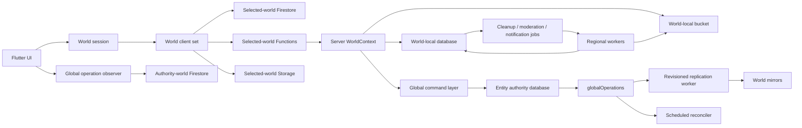

# Firestore multi-world implementation plan

## Status

- Status: draft for review
- Source design:
  `internal-docs/design/global-consistency-server-operations.md`
- Planning baseline: `8a4110b`
- Current production mapping: `asia -> (default) -> asia-northeast1`
- Target initial worlds: `asia`, `northAmerica`, and `europe`
- Firestore edition: Standard

This plan converts the approved consistency design into reviewable,
independently deployable work. It deliberately avoids a big-bang rewrite.
Every stage must preserve the current Asia-only behavior until its activation
gate is explicitly opened.

## Outcome

When this plan is complete:

- notes, messages, memberships, visits, likes, reports, moderation queues, and
  other regional content are isolated in the selected world's database;
- each user has one immutable `homeWorld` for private account authority;
- profiles, social edges, block state, entitlements, and account-safety state
  have one distributed authority and revisioned mirrors;
- regional interaction paths consult local enforcement mirrors and do not add
  routine cross-region reads;
- global writes return `accepted` after the authority commit and expose durable
  completion through `globalOperations`;
- Firestore, Storage, Functions, indexes, Rules, workers, monitoring, and
  cleanup are provisioned as one world bundle;
- optimistic moderation, notification delivery, and cleanup are durable,
  observable asynchronous workflows;
- another world can be added without adding a new branch to every repository
  or handler.

## Non-goals

The initial implementation will not:

- move a user's immutable home authority after assignment;
- move a note or message between worlds;
- provide a single all-world note feed or all-world managed-note list;
- provide synchronous cross-database transactions;
- promise exactly-once Functions, FCM, or Storage side effects;
- add a general private-note invitation system;
- shard popular counters before measurements demonstrate a hotspot;
- delete or relocate existing production data as part of infrastructure setup.

## Validated platform assumptions

The implementation relies on the following current platform behavior:

- Firebase projects support multiple Firestore databases, and client libraries
  select a named database when constructing the client:
  <https://firebase.google.com/docs/firestore/manage-databases>
- FlutterFire `cloud_firestore` 6.6.0 already exposes
  `FirebaseFirestore.instanceFor(app:, databaseId:)`.
- Cloud Functions v2 Firestore triggers accept a `database` option, but each
  trigger is attached to exactly one database:
  <https://firebase.google.com/docs/functions/firestore-events>
- `firebase.json` accepts one Firestore entry per database, with independently
  deployable Rules and indexes:
  <https://firebase.google.com/docs/cli#configuration_for_multiple_cloud_firestore_databases>
- the Firestore emulator creates configured named databases, but does not
  enforce composite indexes and its UI has limited named-database support:
  <https://firebase.google.com/docs/emulator-suite/connect_firestore>

**Decided with explicit risk acceptance:** use Firebase Admin Node's
named-database `getFirestore(databaseId)` overload in production even while
the current reference labels it Preview and advises against production use.
Named-database construction must remain confined to
`WorldFirestoreProvider`; business handlers must receive a `Firestore`
instance and must not import or call the overload directly. Pin the exact
Firebase Admin version, validate every upgrade in emulator and staging, and
retain `new Firestore({projectId, databaseId})` from the stable
`@google-cloud/firestore` server client as the documented replacement path if
the Preview surface changes or regresses. This accepts SDK-surface risk, not
weaker data-consistency, retry, or observability requirements.

Required production controls:

- pin `firebase-admin` to an exact reviewed version and prohibit unattended
  dependency updates;
- accept only catalog allowlisted database IDs, cache one client per database,
  and assert that the returned client's `databaseId` equals the requested
  descriptor before any operation;
- run read, write, transaction, batch, query, trigger, and cross-database
  replication contract tests against every staging database before an SDK
  upgrade or world activation;
- expose per-world read and write enablement switches so a faulty named
  database route can be disabled without taking Asia offline;
- label errors, latency, retries, and operation backlog by world and database
  ID, with alerts for route mismatch, `NOT_FOUND`, permission, and transaction
  regressions;
- keep the stable Google Cloud server-client adapter buildable and covered by
  the same contract suite so an emergency replacement does not require
  business-handler changes.

## Current-state findings

### Client

- `firestoreProvider` always returns `FirebaseFirestore.instance`.
- `firebaseStorageProvider` always returns the default bucket.
- Functions routing currently chooses the nearest available Functions region,
  but does not select a matching Firestore database or Storage bucket.
- region selection follows current location automatically. The approved design
  instead requires an explicit, persistent `selectedWorld`.
- account creation, public-profile synchronization, and some profile reads
  write or read the default database directly.
- note and message repositories retain one Firestore, Functions, and Storage
  instance for their entire lifetime.
- routes and entities generally identify content only by `placeId`; a
  cross-world identity must include `worldId`.

### Functions

- every handler uses the default `getFirestore()` client.
- every image path uses the default `getStorage().bucket()`.
- all callable and scheduled functions are deployed only in
  `asia-northeast1`.
- most business handlers construct their own Firebase clients, making routing
  difficult to test or enforce centrally.
- asynchronous notification and Storage work is still best effort in several
  paths.
- the current single Firestore trigger does not specify a database.

### Rules, indexes, and infrastructure

- `firebase.json` contains one Firestore configuration and one Storage Rules
  configuration.
- `.firebaserc` has no multi-bucket deploy targets.
- `firestore.rules` and `firestore.indexes.json` assume one database.
- direct Storage reads are allowed to any authenticated user; the approved
  design requires server-authorized signed downloads.
- there is no checked-in infrastructure definition for databases, buckets,
  delete protection, TTL policies, IAM, alerts, or catalog activation.

### Tests and CI

- the current baseline passes `flutter analyze`, 134 Flutter tests,
  Functions lint/build, and 22 Functions tests.
- the Android workflow does not run Functions checks.
- Functions tests are mostly pure unit tests; no emulator test currently
  validates multi-database transactions, triggers, or retry behavior.
- no automated Firestore Rules attack suite exists.
- the emulator cannot prove composite-index readiness, so a staging deployment
  test is required before catalog activation.

## Architectural boundaries



The UI and domain repositories must not construct raw Firebase clients.
Functions business handlers must not call `getFirestore()` or
`getStorage().bucket()` directly. Those two rules are the main mechanism for
hiding multi-world complexity.

## World catalog and routing kernel

### Stable identifiers

Use separate identifiers for domain routing and Firebase resources:

| World | `worldId` | `databaseId` | Functions region |
| --- | --- | --- | --- |
| Asia | `asia` | `(default)` | `asia-northeast1` |
| North America | `northAmerica` | `north-america` | `us-central1` |
| Europe | `europe` | `europe` | `europe-west1` |

Bucket names remain deployment configuration because they must be globally
unique.

### Catalog entry

The source-controlled, versioned server catalog must provide:

```text
worldId
databaseId
firestoreLocation
functionsRegion
bucketName
displayNameKey
catalogState
homeAssignmentEnabled
contentAccessEnabled
```

Recommended catalog states:

```text
provisioning -> mirrorOnly -> contentEnabled -> homeEnabled
```

`homeEnabled` is intentionally last. Before that transition, disabling a new
world does not strand an immutable user authority there.

The server catalog is authoritative. The client obtains a filtered public
catalog from `getWorldCatalog`, caches it, and submits only `worldId`.
Resource names supplied by a client are always ignored.

### Client kernel

Add application-layer types outside `providers.dart` and expose them through
providers declared in `providers.dart`, preserving the repository's provider
placement rule:

```text
WorldId
WorldDescriptor
WorldCatalog
WorldSelection
WorldFirebaseClients
WorldRoute
GlobalEntityRoute
```

`WorldFirebaseClients` constructs and caches:

- `FirebaseFirestore.instanceFor(databaseId: descriptor.databaseId)`;
- `FirebaseFunctions.instanceFor(region: descriptor.functionsRegion)`;
- `FirebaseStorage.instanceFor(bucket: descriptor.bucketName)`.

Replace `effectiveRegionProvider` with:

- `worldCatalogProvider`;
- `homeWorldProvider`;
- `selectedWorldProvider`;
- `selectedWorldClientsProvider`;
- a family provider for an explicitly routed world;
- `globalOperationRepositoryProvider`.

Changing `selectedWorld` invalidates world-scoped repositories and streams.
It never changes `homeWorld`.

### Server kernel

Add one server-owned adapter:

```text
WorldRegistry
WorldContext
WorldFirestoreProvider
WorldBucketProvider
AuthorityRouter
CallableRouteValidator
```

Business handlers receive `WorldContext` or a narrower dependency interface.
Thin exported Functions resolve the trusted context and then call pure handler
code. A lint rule or repository test rejects new raw `getFirestore()` and
default-bucket calls outside the adapter.

Callables with the same public name may be deployed in all three regions.
Each request contains a `worldId` or an entity route, and the adapter validates
that the target is active and appropriate for that operation. Firestore
triggers and scheduled jobs are exported once per world because a v2 Firestore
trigger cannot match several databases.

## Target data ownership

The following schema avoids copying private account fields into a publicly
readable profile document:

| Path | Authority | Replication | Client access |
| --- | --- | --- | --- |
| `userHomes/{uid}` | bootstrap directory authority | every world | owner read; server write |
| `users/{uid}` | user's `homeWorld` | none | owner read; trusted write |
| `publicProfiles/{uid}` | user's `homeWorld` | every world | authenticated read; trusted write after migration |
| `userEntitlements/{uid}` | user's `homeWorld` or subscription event authority | every world | server read/write; owner access only if required |
| `userUsage/{uid}` | each content world independently | none | server read/write |
| `socialEdges/{edgeId}` | follower's `homeWorld` | every world | authenticated read; trusted write |
| `users/{blocker}/blockedUsers/{blocked}` | blocker's `homeWorld` | every world | owner/local enforcement reads; trusted write |
| `accountSafety/{uid}` | subject's `homeWorld` | every world | server enforcement; restricted admin/owner presentation |
| `places/{placeId}` and children | selected content world | none | existing domain authorization |
| `globalOperations/{operationId}` | mutated entity's authority world | none | bound owner read; trusted write |
| `cleanupQueues/*/jobs/{jobId}` | target world | none | server only |
| `notificationOutbox/{eventId}` | delivery owner world | none | server only |
| `moderationJobs/{jobId}` | content world | none | server only |
| `moderationReviews/{reviewId}` | content world | none | callable admin access only |
| `moderationAuditLogs/{eventId}` | event world | none | callable admin access only |

`users/{uid}` must not be replicated wholesale. It currently contains email
and other private account state, while regional code needs only a small public
profile and entitlement subset. The explicit `publicProfiles` and
`userEntitlements` collections preserve the Rules boundary and keep mirror
schemas stable.

Every reference that can leave one database uses:

```text
worldId + entityId
```

This applies to notification routes, moderation targets, administrator invite
links, locally persisted pending operations, Crashlytics metadata, and support
tools. A bare `placeId` is only valid inside an already resolved world context.

## Global command layer

### Authority transaction

One reusable `executeGlobalCommand` implementation must:

1. authenticate and validate App Check;
2. resolve authority without trusting a client-supplied database ID;
3. validate the client-generated `operationId`;
4. canonicalize and hash the command payload;
5. transactionally check the operation binding;
6. validate business preconditions;
7. increment only that entity's revision;
8. write the authority entity or revisioned tombstone;
9. create `globalOperations/{operationId}` with a snapshot of
   `worldCatalogVersion` and `requiredWorlds`;
10. return `accepted`, `authorityWorld`, `operationId`, and current status.

The command layer is generic only for the envelope and delivery mechanics.
Entity-specific validation and mutation remain typed handlers. Avoid a single
switch containing all product behavior.

### Replication

For each world database:

- deploy an `onDocumentCreated` trigger for
  `globalOperations/{operationId}`;
- invoke the same idempotent replication service;
- read the current authority entity revision;
- apply destination state only when the revision is newer;
- create required local cleanup intents in the same destination transaction
  when the operation is safety-critical;
- acknowledge the destination on the authority operation;
- if a worker stops after destination commit but before acknowledgement,
  replay observes the destination revision and records the missing ack.

The operation becomes `complete` only after its snapshotted required
acknowledgements exist. Pending operations have no TTL. Terminal operations
receive a 30-day TTL.

### Reconciliation

Deploy a scheduled reconciler in every authority-capable world:

- run every 15 minutes;
- query bounded old `pending` operations;
- reuse the replication service;
- checkpoint pagination;
- emit warning and critical metrics at the approved ages;
- never reconstruct non-commutative state by summing event history.

### Flutter observation

`GlobalOperationRepository` stores `(authorityWorld, operationId)` locally
before or immediately after command acceptance, listens through the
authority-world Firestore client, and restores pending listeners after
navigation and app restart.

UI states:

```text
submitting -> accepted/processing -> complete
                              \-> delayed/processing
pre-commit deterministic rejection -> failed
```

There is no arbitrary five-second server wait.

## Durable worker primitives

Implement shared queue infrastructure before product workflows depend on it.

### Common job behavior

- deterministic job ID;
- `pending | running | complete`;
- short transactional lease;
- attempt count and bounded exponential backoff with jitter;
- cursor/checkpoint for bounded batches;
- idempotent handler;
- revision or terminal-state guard before mutation;
- no TTL while pending or running;
- 30-day TTL after completion;
- event-driven fast path plus scheduled reconciliation;
- structured errors without submitted content or signed URLs.

### Separate queues

Keep separate deployments and concurrency controls for:

- `cleanupQueues/firestore/jobs`;
- `cleanupQueues/storage/jobs`;
- `moderationJobs`;
- `notificationOutbox`.

They may share parsing, lease, retry, logging, and metric utilities, but their
handlers and IAM scopes remain separate.

## Implementation phases

### Phase 0 — platform spike and immutable decisions

Deliverables:

- a small `WorldFirestoreProvider` proof of concept;
- named database read, transaction, batch, collection-group query, and
  cross-database replication tests;
- one Functions v2 trigger bound to a named emulator/staging database;
- a decision record documenting the accepted Firebase Admin Preview boundary,
  exact-version pinning, upgrade validation, and the stable
  `@google-cloud/firestore` replacement path;
- confirmation that Functions service accounts have least-privilege access to
  all required databases and buckets;
- decisions on home-directory authority, legacy accounts, minimum app version,
  and infrastructure management.

Exit criteria:

- the Preview overload is called only by `WorldFirestoreProvider`;
- emulator and staging spike both pass;
- the chosen adapter can be replaced without touching business handlers.

Rollback: delete only spike resources from the non-production project. No
production data or code path changes.

Implementation note (2026-07-30): P01 uses a source-controlled JSON catalog
validated strictly by both TypeScript and Dart. World IDs remain dynamic
strings on the client rather than a three-value application enum. Every catalog
entry has a provisioned, non-null regional bucket; provisioning worlds keep
deny-all Storage Rules until activation. See ADR 0002.

### Phase 1 — test and deployment foundation

Deliverables:

- three Firestore entries in `firebase.json`;
- separate or shared source-controlled Rules and index files with explicit
  database mappings;
- three configured Storage targets and Rules deployment mappings;
- checked-in infrastructure definitions or idempotent provisioning scripts for
  databases, locations, buckets, delete protection, TTL, IAM, and monitoring;
- named-database emulator configuration;
- Rules unit tests using `@firebase/rules-unit-testing`;
- Functions emulator integration harness;
- CI jobs for Functions lint/build/test and emulator integration;
- a staging index-readiness test because the emulator does not enforce
  composite indexes.

Implementation note (2026-07-31): the initial Rules harness uses
`@firebase/rules-unit-testing` and a dedicated demo-project emulator config.
It loads the application Rules and the provisioning-world deny-all Rules into
separate emulator namespaces, then tests authentication, ownership, schema
pollution, server-only collections, block visibility, moderation visibility,
and locked-world access as independent cases. This separation is intentional:
the Firestore emulator does not emulate multiple database IDs, while the
named-database contract test covers database routing and isolation separately.

The Functions harness starts Auth, Firestore, and Functions together under a
`demo-*` project. It verifies callable authentication rejection, an
authenticated App-Check-shaped request that writes through a real handler,
and invalid-input rejection without a Firestore write. The initial contract
uses an account notification setting because it exercises the complete
request path without contacting Storage, FCM, OpenAI, or another non-emulated
service.

Exit criteria:

- a clean environment can be provisioned repeatably;
- all three databases start default-deny and receive reviewed Rules;
- no client route points at the new databases.

Rollback: remove new deployment configuration from the app while leaving empty
protected resources intact.

### Phase 2 — behavior-preserving world kernel

Deliverables:

- shared world catalog schema and generated/validated Dart and TypeScript
  representations;
- Flutter world client cache and selected-world providers;
- server `WorldContext` and dependency-injected handlers;
- conversion of raw default Firestore/Storage access to adapter access;
- explicit `worldId` on all regional callable requests and responses;
- `WorldRoute` added to note navigation, notifications, moderation targets,
  and persistent identifiers;
- Asia maps to `(default)` so production behavior is unchanged;
- repository tests proving a world switch disposes old streams and uses the
  matching Firestore, Functions, and Storage clients.

Do not enable North America or Europe yet.

Exit criteria:

- raw Firebase client construction exists only in approved adapters;
- all existing tests pass with `asia -> (default)`;
- a test fails if Firestore, Functions, and Storage resolve to different
  worlds.

Rollback: catalog exposes only Asia; the adapter continues targeting the
default resources.

### Phase 3 — account bootstrap and private/public separation

Deliverables:

- immutable home assignment command;
- onboarding that recommends the nearest world but requires explicit
  confirmation and explains immutability;
- onboarding release gated by the selected home's acknowledgement and
  required local account initialization, not by all-world acknowledgement;
- a home-assignment global operation that remains `pending` after onboarding
  until every snapshotted active-world mirror acknowledges;
- atomic per-destination bootstrap installation using the local
  `userHomes/{uid}` epoch as the readiness marker;
- world selection, notification, invite, and deep-link guards that refuse an
  unprepared destination without initiating on-demand replication;
- `homeWorldProvider` distinct from `selectedWorldProvider`;
- private `users/{uid}` authority in the home world;
- server-owned `publicProfiles` writes;
- `userEntitlements` mirror for `isPremium`;
- local `userUsage/{uid}.activeNoteCount`;
- Firebase Auth custom claim used only as a cache for the caller's home, never
  as the sole target-user routing source;
- removal of client-side public-profile authority writes;
- backfill tooling with dry-run, checkpoint, idempotency, and audit output.

Recommended legacy policy:

- existing users receive `homeWorld: asia`;
- existing notes/messages remain in Asia;
- no content relocation occurs.

Exit criteria:

- concurrent first-assignment attempts cannot create two home authorities;
- a user can enter the app when the selected home is ready while delayed
  non-home mirrors remain observable and retryable;
- an unprepared world cannot become `selectedWorld`, and becomes selectable
  after the existing Outbox path installs its bootstrap marker;
- callables and direct-write Rules reject stateful writes when the caller's
  local bootstrap marker is missing;
- an account can read private state only in its home world;
- regional handlers read no email or other PII from a replicated document;
- premium limits work independently in every world.

Rollback: stop new home assignment. Already assigned homes are immutable and
must continue to be served.

### Phase 4 — global operation infrastructure

Deliverables:

- operation envelope and validators;
- canonical payload hashing;
- authority transaction helper;
- per-entity revision helper and tombstone helper;
- per-database replication triggers;
- reconciler, acknowledgement logic, TTL, alerts, and replay tooling;
- Flutter durable operation observer;
- administrator status view for stuck operations.

Pilot order:

1. language preference;
2. public profile;
3. notification preference;
4. follow edge;
5. safety-critical block and account-safety state.

Exit criteria:

- duplicate and out-of-order events cannot regress a mirror;
- a crash between destination apply and authority ack repairs correctly;
- the same operation ID and payload is idempotent;
- the same operation ID with another payload is rejected;
- catalog expansion tests prove old operations keep their original target set.

Rollback: stop accepting new command versions and keep reconcilers running
until every accepted operation is terminal.

### Phase 5 — cleanup and non-Firestore outbox infrastructure

Deliverables:

- Firestore cleanup runner and handler registry;
- Storage cleanup runner and handler registry;
- scheduled job reconcilers;
- notification outbox base contract;
- structured metrics and alerts;
- operator replay and inspection commands;
- deterministic cleanup IDs and revision guards.

Initial handlers:

- invite revocation;
- obsolete snapshot cleanup;
- block follow/access/scheduled-message cleanup;
- moderation retention cleanup;
- image deletion;
- orphan upload deletion.

Exit criteria:

- worker termination at every checkpoint is recoverable;
- an absent Storage object counts as successful deletion;
- a stale cleanup job cannot delete state created by a newer revision;
- pending work is never removed by TTL.

Rollback: stop new producers only after their parent feature is disabled; keep
workers and reconcilers alive until the queue drains.

### Phase 6 — profiles, social graph, and notification authority

Deliverables:

- home-authoritative profile mutation and revision propagation;
- revision-guarded creator/member snapshots;
- follower-owned social edges;
- convergent follower/following aggregates;
- home-world notification settings and FCM tokens;
- home-owned account/global notice delivery;
- source-world regional-content notification delivery;
- per-recipient event deduplication, retry schedule, expiry, and token cleanup;
- local block and content-visibility recheck immediately before FCM send.

Exit criteria:

- `updateDisplayName` no longer synchronously scans unbounded documents;
- counts can be rebuilt from edge truth;
- one logical event has one deterministic delivery owner;
- no token or notification preference is copied into content databases;
- one in-flight push during block propagation is the only accepted block race.

Rollback: disable push producers while retaining in-app notices and draining
already accepted outbox events according to their expiry policy.

### Phase 7 — block and account-safety enforcement

Deliverables:

- blocker-home authority and directional revisioned mirrors;
- all-world completion acknowledgement;
- 90-day inactive mirror tombstones;
- immediate client filtering after block acceptance;
- durable symmetric owned-note and scheduled-message cleanup;
- subject-home account-safety authority;
- local safety mirror checks on every affected write path;
- 0–100 point scale, lazy decay, restrictions, bans, admin overrides, and
  one-year metadata-only safety audit retention;
- in-app admin operation progress and history.

Exit criteria:

- every interaction path has an explicit block/safety test;
- a completed block is enforced by all active worlds;
- cleanup failure cannot reopen access;
- duplicate moderation events cannot add points twice;
- restriction and ban expiry uses server timestamps and does not require a
  global scheduled scan.

Rollback: do not disable enforcement mirrors. Roll back only command ingress
or UI while repair workers remain active.

### Phase 8 — regional content refactor

Deliverables:

- all note/message/member/visit/like/report operations accept one resolved
  `WorldContext`;
- per-world schedulers for archive and scheduled-message publication;
- scheduled-message worker drains a bounded backlog rather than processing
  only one fixed page;
- world-aware admin moderation list and cursor;
- local `userUsage` quota accounting with exact slot ownership;
- Rules and indexes for every regional database;
- source-world identity on moderation and notification events;
- no direct default-database assumption in Flutter repositories or Functions.

Keep Europe and North America in `mirrorOnly` while this is tested.

Exit criteria:

- the full current feature suite runs against each named staging database;
- a note ID collision across worlds cannot misroute any operation;
- map, note detail, messages, and My Notes never mix selected-world streams;
- existing Asia data remains readable without migration.

Rollback: catalog keeps new-world content access disabled.

### Phase 9 — regional Storage and signed image access

Deliverables:

- one verified regional bucket per world;
- world-relative immutable upload paths;
- direct client upload to the selected world's final path;
- signed-URL batch endpoint with local Firestore authorization;
- 24-hour private client cache and signed-query redaction;
- direct Storage reads denied by Rules;
- `imageUploads` finalize tracking;
- 24-hour orphan grace period and hourly sweep;
- generation-guarded deletion jobs;
- message/pin image cache keys that include world and immutable path.

Exit criteria:

- no trusted code calls the implicit default bucket;
- a private or hidden content image cannot receive a new signed URL;
- rejection or deletion writes durable cleanup before reporting lifecycle
  completion;
- stale jobs cannot delete replacement objects;
- bucket location is verified, not inferred from its name.

Rollback: keep direct reads enabled only during a short dual-path rollout.
After signed access is mandatory, rollback restores the previous application
version and Rules together; never change Rules alone.

### Phase 10 — note-administrator invitations

Deliverables:

- remove the general reusable member invite flow and UI;
- target-UID-bound, single-use, seven-day administrator invitation;
- signed versioned world hint and nonce;
- creator/administrator delegation and flat revocation;
- 100 pending invitations and 100 non-creator administrators per note;
- exact invitation/admin counters;
- selected-world consent after successful cross-world acceptance;
- immutable administrator audit events;
- current-world-only managed-note discovery.

Exit criteria:

- forwarding a link cannot grant authority to another UID;
- opening a link never silently changes the selected world;
- concurrent accepts cannot exceed the administrator limit;
- expired or revoked invitations cannot be accepted;
- the creator can never be removed.

Rollback: disable new invitation creation; continue serving existing pending
links until they expire or are revoked.

### Phase 11 — optimistic moderation

Deliverables:

- client-generated idempotent note and message IDs;
- local acceptance transactions with `moderationAction: pending`;
- optimistic public notes and messages;
- independent pending pin-image candidates;
- regional moderation jobs and workers;
- retry/backoff without worker-control fields on content documents;
- terminal guards against late or duplicate verdicts;
- notification intent created only during visible terminal finalization;
- high-confidence hidden event forwarded durably to account safety;
- hidden note slot released exactly once;
- administrator restoration, including trusted temporary quota overage;
- 30-day hidden content/image retention;
- one-year metadata-only audit retention with keyed HMAC fingerprint;
- cleanup of dormant subtrees and image objects after retention.

Exit criteria:

- provider unavailability does not delay note/message acceptance;
- an old verdict cannot overwrite a newer or administrator decision;
- a hidden parent immediately gates every child read/write path;
- restoration within 30 days restores all retained data and images;
- restoration after cleanup is impossible and clearly reported;
- normal content produces no extra audit document beyond its content fields.

Rollback: switch acceptance back to synchronous moderation while allowing
already accepted pending jobs to finish. Never abandon pending content.

### Phase 12 — staged activation and production cutover

Activation sequence for each new world:

1. provision protected empty resources;
2. deploy Rules, indexes, Functions, buckets, TTL, workers, and monitoring;
3. keep catalog state `provisioning`;
4. backfill global mirrors and record a high-water mark;
5. reconcile every replicated entity to that mark;
6. change to `mirrorOnly`;
7. run synthetic and internal-user traffic;
8. change to `contentEnabled`;
9. observe content traffic without assigning user homes;
10. enforce the minimum compatible app version;
11. change to `homeEnabled`;
12. allow new users to choose that immutable home.

North America and Europe should be activated separately, not in one release.

Exit criteria:

- candidate SLOs hold under staged traffic;
- no pending safety operation is older than its warning threshold;
- queue backlog and oldest-age metrics are healthy;
- Security Rules attack tests pass for all three databases;
- staging proves every required composite index;
- backup/export and restore procedures have been rehearsed;
- support and admin tools display world-aware identifiers.

Rollback before `homeEnabled`: set `contentAccessEnabled: false`, stop new
regional writes, and keep workers draining.

Rollback after `homeEnabled`: the world cannot simply be removed because it
owns immutable authorities. Keep account/global command service available,
disable only new home assignments and optional content creation, and repair or
roll forward.

## Pull-request and commit decomposition

Do not implement the phases as one branch-wide commit. Recommended review
units:

| Unit | Scope | Depends on |
| --- | --- | --- |
| P00 | named-DB server adapter spike and ADR | none |
| P01 | world catalog schema and generated validation | P00 |
| P02 | multi-DB Firebase config and emulator harness | P00 |
| P03 | Functions and Rules CI | P02 |
| P04 | Flutter world client kernel, Asia-only | P01 |
| P05 | Functions `WorldContext`, Asia-only | P01 |
| P06 | world-aware entity routes and navigation | P04 |
| P07 | home bootstrap and account schema split | P04, P05 |
| P08 | global operation envelope and authority transaction | P07 |
| P09 | replication triggers, reconciler, and Flutter observer | P08 |
| P10 | cleanup worker framework | P05 |
| P11 | notification outbox framework | P05, P10 |
| P12 | profile and entitlement replication | P09 |
| P13 | social edge authority and aggregate rebuild | P09, P12 |
| P14 | block replication and cleanup | P09, P10, P13 |
| P15 | account-safety authority and admin controls | P09, P10 |
| P16 | regional content handlers and schedulers | P05, P14, P15 |
| P17 | regional Storage and signed image access | P10, P16 |
| P18 | administrator invitation replacement | P11, P16 |
| P19 | notification ownership and retry migration | P11, P14, P16 |
| P20 | optimistic note/message/image moderation | P10, P15, P17, P19 |
| P21 | backfill, high-water reconciliation, activation tooling | all above |
| P22 | one-world-at-a-time production activation | P21 |

Each unit must include its own tests and migration compatibility. Avoid a
separate final “add tests” phase.

## Verification matrix

### Pure unit tests

- world/catalog parsing and invalid state transitions;
- authority routing;
- operation ID and payload binding;
- per-entity revision allocation;
- destination revision comparison;
- tombstone semantics;
- retry/backoff calculations;
- job lease and cursor transitions;
- account-safety decay and thresholds;
- signed invitation parsing and expiry;
- signed image authorization decisions;
- moderation terminal guards;
- notification expiry and FCM result classification.

### Emulator integration tests

- separate data isolation for all three database IDs;
- authority mutation plus operation creation atomicity;
- duplicate and out-of-order replication;
- destination commit followed by missing ack recovery;
- block completion and cleanup-intent durability;
- cross-world follow removal;
- account-safety mirror enforcement;
- note quota independence;
- hidden parent child-access denial;
- Rules tests for unauthenticated, wrong owner, schema pollution, immutable
  field changes, oversized data, role escalation, orphan subcollections,
  query/rule mismatch, and direct writes to server-only collections;
- Storage upload ownership and direct-read denial.

### Staging integration tests

The emulator cannot prove these:

- composite indexes;
- real multi-region latency and egress;
- Functions trigger delivery for each named database;
- FCM behavior;
- signed URLs and bucket IAM;
- Storage finalize events and generation preconditions;
- TTL timing;
- App Check enforcement;
- cold starts and region placement.

### Failure injection

For every asynchronous workflow, test:

- duplicate event;
- reversed event order;
- worker crash before mutation;
- worker crash after destination mutation but before ack;
- expired lease;
- one unavailable world;
- unavailable moderation provider;
- unavailable FCM;
- unavailable Storage;
- stale cleanup revision;
- retry after client restart;
- catalog activation during an older pending operation.

## Security work

Before changing Rules, produce an updated collection/query inventory and keep
it untracked while Rules are developed. Every create and update rule must use
strict domain validators, field allowlists, type/size constraints, immutable
field checks, and default deny.

Specific multi-world controls:

- a client-provided database ID, region, bucket, authority world, or revision
  never establishes trust;
- private `users` data stays only in the home database;
- clients cannot write revisions, mirrors, operations, safety state, audit
  events, worker jobs, FCM tokens, or counters;
- `globalOperations` can be read only by the bound caller;
- administrator access requires the `admin: true` custom claim at the server;
- signed invitation and image URLs are redacted from logging;
- HMAC secrets, password pepper, and invitation signing keys are distinct;
- Functions service accounts receive only the databases/buckets and operations
  required by their worker type.

Run the Firestore Security Rules audit workflow after every Rules change, not
only at final cutover.

## Observability and cost controls

Every log and trace should include, where applicable:

```text
worldId
databaseId
functionRegion
operationId
operationType
entityType
entityId
revision
sourceWorld
authorityWorld
targetWorld
attemptCount
leaseAge
queueAge
```

Never log content text, image bytes, passwords, tokens, signed query strings,
or raw HMAC secrets.

Dashboards and alerts:

- callable latency and Firestore transaction retries per world;
- cross-region reads/writes and egress;
- operation completion latency and outstanding ack count;
- oldest pending global operation;
- cleanup, moderation, and notification queue depth/age;
- scheduled-message and archive backlog;
- FCM error classification;
- orphan-upload age;
- moderation provider latency/action distribution;
- active note and message aggregate contention;
- Functions cold starts and instance saturation.

Initial cost protections:

- bounded query pages and worker concurrency;
- no periodic scan of all users for point decay;
- no replication of regional content;
- no replication of FCM tokens or private account documents;
- single-field index exemptions for payloads, timestamps, and audit fields that
  are never queried;
- TTL only after durable terminal guards;
- warn on unexpected cross-region hot-path reads.

## Migration and compatibility

### Existing data

The safe default is:

- keep every existing place and child document in Asia;
- assign every existing account to Asia;
- backfill revision 1 authorities and mirrors without deleting current fields;
- migrate reads first, then trusted writes, then remove legacy fields in a
  later release;
- export/backup before each destructive cleanup;
- never reuse an object path or database ID during migration.

### Old clients

An old client knows only `(default)`, performs some direct profile writes, and
does not send a world-aware route. It cannot safely manage an account whose
home is Europe or North America.

Before any non-Asia home assignment:

- ship the world-aware client;
- stop client-authoritative public-profile writes;
- provide a protocol/catalog capability check;
- define and enforce a minimum supported app version or maintain a complete
  compatibility shim;
- observe adoption and error rates.

The recommended policy is a minimum-version gate rather than a long-lived
dual-authority compatibility layer.

### Backfill mechanics

Every backfill command must support:

- dry run;
- explicit source and target project;
- bounded page size;
- stable cursor/checkpoint;
- deterministic target IDs;
- revision guard;
- resumability;
- per-page counts and content-free error output;
- final high-water reconciliation;
- no delete by default.

## Deployment gates requiring confirmation

These are not implementation details and should be decided before the
dependent phase:

1. **Home-directory authority:** use the Asia `(default)` database as the
   single bootstrap authority for `userHomes`, then replicate it to all worlds
   (recommended), or accept a more complex distributed first-assignment
   protocol.
2. **Legacy assignment:** assign all existing accounts and content to Asia
   without relocation (recommended), unless the current project can be treated
   as disposable.
3. **Old-client policy:** enforce a minimum compatible app version before
   enabling non-Asia home assignment (recommended), or build and maintain a
   compatibility shim.
4. **Infrastructure ownership:** use Terraform for databases, buckets, IAM,
   delete protection, TTL, and alerts, while Firebase CLI deploys
   Rules/indexes/Functions (recommended), or use checked-in idempotent CLI
   scripts.

## Recommended first execution slice

Start with P00–P05 only:

1. prove the server named-database adapter;
2. create the versioned world catalog contract;
3. configure three emulator databases;
4. add Functions and Rules CI;
5. introduce Flutter and Functions world contexts while keeping Asia as the
   only active world.

This slice changes no product data placement and provides the foundation and
tests needed for every later phase. Because the current Firebase project is
still pre-production, the user approved creating the protected Europe and
North America databases during the P00 spike. They remain client-inaccessible
and must not become active worlds until the remaining deployment gates above
are resolved.

## Definition of done

The multi-world project is not complete merely because three databases exist.
It is complete only when:

- all code paths resolve an explicit trusted world;
- global authorities and mirrors pass failure-injection tests;
- safety operations meet their completion guarantees;
- every non-Firestore side effect has durable retry and reconciliation;
- Rules and indexes are deployed and verified for every active database;
- each bucket is colocated, access-controlled, and cleanup-observed;
- existing data remains intact and the migration is resumable;
- old clients cannot corrupt distributed authority;
- operations and workers are supportable from world-aware admin tooling;
- one new world can be added through catalog/provision/backfill/activation
  without changing domain repositories.
