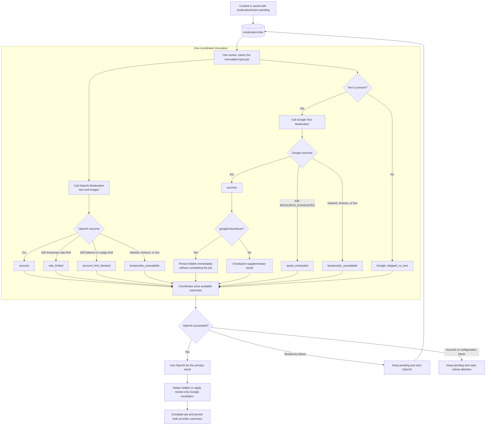

# Firestore moderation and notices model

## Firestore instance

- Project: `world-notes-prod`
- Database: `(default)`
- Edition: `STANDARD`
- Type: `FIRESTORE_NATIVE`

## Existing paths touched by this work

- `users/{uid}`: owner-only profile document. Contains PII fields such as
  `email`; reads must remain owner-only.
- `users/{uid}/fcmTokens/{tokenId}`: server-only token store used by Cloud
  Functions for FCM delivery.
- `users/{uid}/notificationSettings/main`: owner-readable, server-writable.
- `places/{placeId}` and `places/{placeId}/messages/{messageId}`: messages are
  read only by users who can access the parent note. Notes carry
  `isModerationHidden` so moderation can remove them from discovery and public
  reads without changing their archive lifecycle. Messages can carry
  `moderationAction: "pending"` when provider-side moderation is temporarily
  unavailable; pending messages remain visible and should be re-evaluated by a
  future scheduled function.
- `reports/{autoId}`: server-created note or message report events. Reports use
  `targetType`, `targetId`, `targetPath`, and a locale-independent
  `reasonCode`. A shared per-user cooldown covers both target types.

## New path

- `moderationReviews/{reviewId}`: flat administrator review queue for notes and
  messages. Message reviews use `{placeId}_{messageId}` and note reviews use
  `note_{placeId}` as deterministic document ids. Every record identifies its
  content exclusively through `targetType`, `targetId`, and `targetPath`; the
  target-specific `messageId` and `messagePath` fields are not stored. The
  review stores submitted content, optional image storage paths, provider
  scores, derived action, review sources, risk signals, report count/summary,
  and review status.
- `moderationAuditLogs/{logId}`: server-only append log for both automated
  rejections and administrator decisions. `eventType` distinguishes
  `automatedRejection` from `adminDecision`, and `actorType` distinguishes the
  moderation provider from an administrator. Automated entries retain
  provider metadata, the affected user, source type, and post-decision
  violation-point total. Administrator entries retain the affected target,
  affected user, reason, and previous moderation state. The collection never
  stores submitted text or image bytes and is not an administrator review
  queue.
- `users/{uid}/notices/{noticeId}`: app inbox items for moderation warnings,
  account restrictions, bans, report outcomes, and future developer messages.
  Owner may read and mark read. Creation, deletion, and content changes are
  server-only.

## Queries added

- `users/{uid}/notices.orderBy(createdAt desc).limit(100)`

This is a single-collection query scoped under the signed-in user, so no
composite index is expected.

Future administrator tooling can query `moderationReviews` by `status`,
`createdAt`, `userId`, `placeId`, or `action`. The initial administrator queue
uses `status == "open"` ordered by `createdAt`; the Flutter administrator
screen reads open/resolved queues through `adminListModerationReviews`, not
direct Firestore client reads.

Future delayed moderation tooling can use a collection group query over
`messages` where `moderationAction == "pending"`. Add the required index when
that scheduled function is implemented.

## Rule requirement

- Require auth.
- Allow only the owner to read their notices.
- Allow only owner updates to `readAt`, because notice text/severity/action are
  authoritative server content.
- Deny client create/delete.
- Deny all client access to `moderationReviews`.
- Deny all client access to `moderationAuditLogs`.

## Administrator access

Moderation administrator access is controlled by Firebase Auth custom claims.
The callables `adminListModerationReviews`, `adminReviewMessage`, and
`adminReviewNote` require `admin: true`; hiding the Flutter UI is only a
convenience, not the authorization boundary.

The Flutter profile screen only links to `/admin/moderation` when the current
ID token contains `admin: true`. The screen still calls the same trusted
callables, so direct route access by a normal user fails at the backend.

### Grant or remove access

Run these commands from `functions/`. Install the Node.js dependencies first
when this is a new checkout:

```bash
cd functions
npm ci
```

The default Firebase project is `world-notes-prod`, as configured in
`.firebaserc`. To target another project, prepend the command with
`GCLOUD_PROJECT=<project-id>`.

The script uses Application Default Credentials (ADC). When local user ADC
does not have a quota project, run the script with a command-scoped quota
project instead of changing the saved ADC configuration:

```bash
GOOGLE_CLOUD_QUOTA_PROJECT=world-notes-prod \
  npm run admin:set -- --email admin@example.com
```

This environment variable applies only to that command. The executing Google
account needs permission to administer Firebase Auth users and the Service
Usage Consumer role (`roles/serviceusage.serviceUsageConsumer`) on the quota
project.

To grant or remove the claim by UID instead of email, replace `--email` with
`--uid`:

```bash
npm run admin:set -- --email admin@example.com
npm run admin:unset -- --email admin@example.com
```

The target user must refresh their ID token or sign in again after the claim
changes. After that, the **Moderation** item appears on the profile screen.

### Check local ADC quota-project configuration

The saved quota project in local user ADC can be inspected with:

```bash
jq -r '.quota_project_id // "(not set)"' \
  ~/.config/gcloud/application_default_credentials.json
```

This is separate from the default project in `gcloud config`. If
`GOOGLE_APPLICATION_CREDENTIALS` is set, ADC uses that credential file before
the local file above; inspect it first with:

```bash
echo "${GOOGLE_APPLICATION_CREDENTIALS:-'(not set)'}"
```

## Moderation evaluation

The version-controlled evaluation set lives at
`functions/evaluation/moderation-cases.json`. Each case has a human-labelled
`expectedAction` (`allow`, `sensitive`, `review`, or `hidden`) and expected
app-level contact-information risk signals. The set covers ordinary diary
entries, contextual safety discussion, contact details, and unsafe content.

`omni-moderation-latest` classifies harmful-content categories; it is not a
general profanity blocklist. Policy version `2026-08-moderation-v3` delegates
profanity and harassment classification to AI moderation providers instead of
maintaining a language-specific word list. The evaluation set keeps both
standalone abuse and contextual quotation cases so provider thresholds can be
checked without reintroducing context-blind exact matching.

Run it from `functions/` only after a reviewer has checked the case labels.
The evaluator calls the live OpenAI Moderation API sequentially; it does not
use Firebase secrets, deploy Cloud Functions, create Firestore data, or print
the test message contents.

```bash
cd functions
read -rs OPENAI_API_KEY
export OPENAI_API_KEY
npm run evaluate:moderation -- --json /private/tmp/world-notes-moderation.json
unset OPENAI_API_KEY
```

The terminal table and optional JSON report contain only case IDs, expected and
actual actions, risk signals, scores, and matched categories. The JSON also
records the provider model and policy version, so reports remain comparable
after a model or policy update. It calculates action accuracy, risk-signal
accuracy, review-queue accuracy, false allows, unexpected moderation, and
review-queue misses.

Use `--fail-on-mismatch` in a controlled validation run to return a nonzero
exit status when any expected action, risk signal, or review-queue result does
not match:

```bash
npm run evaluate:moderation -- --fail-on-mismatch
```

Treat a mismatch as a review task, not an automatic policy change. Review the
case text and the model result, then update either the human label or the
moderation thresholds with an explicit policy decision. Do not commit API keys
or generated reports containing production data.

## Dual-provider moderation target design

This section describes the target design for adding Google Cloud Natural
Language Text Moderation alongside OpenAI Moderation. It is not the current
implementation: the deployed worker currently calls only OpenAI. Both provider
calls should remain inside one moderation job handler rather than being split
into two independently triggered Cloud Functions. The handler starts the
applicable calls concurrently and acts as their coordinator.

OpenAI is the primary provider and its successful result is required to complete
every moderation job. Google evaluates text only and is a supplementary,
one-way safety signal; it is not an availability fallback for OpenAI. Google
cannot finalize `allow`, but a category-specific, high-confidence
`googleClearAbuse` result may immediately hide content while the job continues
waiting for OpenAI. Once that safety override is applied, an OpenAI `allow`
must not automatically restore the content; an administrator may restore it
after review.

When OpenAI succeeds and Google does not return `googleClearAbuse`, OpenAI's
action is authoritative. A lower-confidence Google disagreement may elevate an
OpenAI `allow` or `sensitive` result to `review`, but it cannot lower an OpenAI
action. Exact Google thresholds must be category-specific and validated by the
version-controlled evaluation set before deployment.



The calls should use isolated promises with `Promise.allSettled` or equivalent
coordination. A rejected provider promise must not cancel a successful result
from the other provider, and each provider result should be checkpointed as it
settles so a clear Google abuse result can hide content without waiting for a
slow OpenAI timeout. Persist each successful provider result against the job's
immutable `inputHash`, provider model/version, and policy version before a
retry. For
example, if Google succeeds but OpenAI receives a 429, Google may immediately
hide clear abuse, but the job remains `pending`. The OpenAI retry must reuse the
Google checkpoint rather than consuming another Google request.

### Outcome matrix

| Input | OpenAI | Google | Job result | Retry |
| --- | --- | --- | --- | --- |
| Text only | success | clear abuse | `hidden`; persist both outcomes | None |
| Text only | success | no clear abuse | OpenAI result, optionally elevated to `review` on disagreement | None |
| Text only | success | 429, 5xx, or transport failure | OpenAI result | None |
| Any text input | temporary OpenAI 429, 5xx, or transport failure | clear abuse | Hide immediately but keep job `pending` | Retry OpenAI; reuse Google checkpoint |
| Any text input | temporary OpenAI 429, 5xx, or transport failure | no clear abuse or unavailable | Keep `pending`; Google cannot finalize `allow` | Retry OpenAI |
| Any input | non-retryable OpenAI 429 or authentication/configuration error | any outcome | Keep `pending`, retain any Google safety hide, and raise critical attention | Resume after operator action or the documented limit reset |
| Includes image | success | any text outcome | OpenAI image/text result with upward-only Google text escalation | None |

`unavailable` in this table includes a provider that was skipped because a
project-wide circuit breaker is open. A circuit breaker may suppress known-
failing calls, but it is only a noise and load optimization. It must not be the
source of truth for the Google hard cap; Google Cloud's project quota remains
authoritative.

### OpenAI 429 handling

An OpenAI HTTP 429 does not always mean the same thing. Parse the response body
and retain the provider `error.code`/`error.type` with sanitized operational
metadata:

- A request/token rate-limit response is transient. Respect a valid
  `Retry-After` header. Otherwise use delayed exponential backoff with jitter.
- `credit_balance_exhausted`, `organization_usage_limit_exceeded`,
  `organization_spend_limit_exceeded`, `project_spend_limit_exceeded`, and an
  `insufficient_quota` billing condition do not recover through rapid retries.
  Open a circuit breaker, log an operational error, and require the indicated
  account/limit action.
- Log `x-request-id`. Also log the rate-limit remaining/reset response headers
  when present, without logging submitted text, image bytes, or the API key.
- Do not run an unbounded retry loop inside one Function invocation. Failed
  requests can count toward a per-minute limit and make a retry storm last
  longer.

The current implementation uses raw `fetch`, not an OpenAI SDK, so it has no
SDK-level automatic retry. It currently converts every 429 and 5xx response to
`pending`; the job handler then throws `moderation/provider-unavailable`. The
durable job layer schedules attempts at approximately 1 minute, 5 minutes,
15 minutes, 1 hour, 6 hours, and then 24-hour intervals, each with plus or minus
10 percent jitter. The one-minute reconciler may add up to approximately one
minute before claiming a due job. This existing flow is safe from an in-process
hot loop, but the dual-provider implementation must add the 429 subtype,
response-header, and checkpoint handling described above. Non-retryable
authentication/configuration failures should also stop indefinite automatic
retry and raise critical attention.

OpenAI documents `omni-moderation-latest` as a free moderation model, but it is
still rate limited. Its published free usage tier currently lists 250 requests
per minute, 5,000 requests per day, and 10,000 tokens per minute. A 429 is a
refused request, not a paid overflow beyond those limits.

Official references:

- [OpenAI 429 causes and retry guidance](https://help.openai.com/en/articles/5955604)
- [OpenAI API response and rate-limit headers](https://developers.openai.com/api/reference/overview#debugging-requests)
- [OpenAI omni-moderation-latest model and limits](https://developers.openai.com/api/docs/models/omni-moderation-latest)

## Google Cloud Natural Language setup

The selected production guardrail is a Google-enforced project quota of
**75 Natural Language requests per day**. This avoids a distributed
read-before-call counter: the worker calls the API normally and Google rejects
requests beyond the configured cap with HTTP 429 / `RESOURCE_EXHAUSTED`.
Natural Language quotas are project-wide and shared by every application and IP
address using the project, including manual tests. Per-day usage is reported
according to Pacific Standard Time, not the app's local time zone.

This cap controls request count, not billable Text Moderation units. Google
rounds each Text Moderation request up in 100-Unicode-character units and grants
50,000 Text Moderation units per month free. The longest app text sent to Google
is a 2,000-character message, or at most 20 units. Notes are shorter: their
formatted title and subtitle are at most 321 characters, or 4 units. The
worst-case monthly calculation is therefore:

`75 requests/day * 31 days * 20 units/request = 46,500 units/month`

The remaining 3,500 units provide a seven-percent margin; even 32 quota windows
would consume at most 48,000 units. This guarantee depends on using only the
Text Moderation method, retaining the 2,000-character input maximum, and routing
all Text Moderation calls in this project through the same daily quota. Recheck
the pricing and recalculate the quota before raising the input limit or adding
another Natural Language caller. Keep a zero-dollar-oriented billing alert as
an independent detection measure; a billing alert is not a hard cap.

### 1. Enable the API

Select the same Google Cloud project used by Firebase and confirm that billing
is enabled. In **APIs & Services > Library**, find **Cloud Natural Language
API** and select **Enable**. Enabling an API requires
`serviceusage.services.enable`, normally through Service Usage Admin
(`roles/serviceusage.serviceUsageAdmin`).

The equivalent CLI command is:

```bash
export WORLD_NOTES_PROJECT_ID="world-notes-prod"
gcloud services enable language.googleapis.com \
  --project="$WORLD_NOTES_PROJECT_ID"

gcloud services list --enabled \
  --project="$WORLD_NOTES_PROJECT_ID" \
  --filter="config.name:language.googleapis.com"
```

### 2. Configure runtime authentication

Use the Google-supported `@google-cloud/language` client with Application
Default Credentials. Do not create an API key or store a Google credential in
Firebase secrets. The Cloud Function runtime service account needs Service
Usage Consumer (`roles/serviceusage.serviceUsageConsumer`) on the quota
project. The Natural Language setup guide does not require a separate
product-specific caller role.

For local-only integration testing, authenticate ADC and assign its quota
project explicitly:

```bash
gcloud auth application-default login
gcloud auth application-default set-quota-project "$WORLD_NOTES_PROJECT_ID"
```

### 3. Lower the daily quota to 75

1. Open **IAM & Admin > Quotas & System Limits**, or open **APIs & Services >
   Cloud Natural Language API > Quotas & System Limits**.
2. Filter **Service** to **Cloud Natural Language API**.
3. Select **Requests per day**. Its documented default is currently 800,000;
   **Requests per minute** is 600.
4. Select **Edit**, set the new daily value to **75**, and submit the quota
   adjustment. A value below the default creates a consumer quota override,
   sometimes called a cap.
5. Reopen the row and verify that its effective value is 75. Also inspect its
   usage chart after a controlled test call.

Viewing quotas requires Quota Viewer
(`roles/servicemanagement.quotaViewer`). Requesting the adjustment requires
Quota Administrator (`roles/servicemanagement.quotaAdmin`) or equivalent
permissions. If the specific quota row is not editable, the service does not
offer a consumer override for that row in the selected project; do not replace
it with a distributed Firestore counter. Keep the API disabled until another
provider-enforced control is selected.

### 4. Handle Google quota exhaustion

Treat HTTP 429 / `RESOURCE_EXHAUSTED` from Google as `quota_exhausted` for the
current provider outcome. A successful OpenAI result may finalize the job, so
do not retry Google for that job. A project-wide circuit breaker may suppress
additional Google calls until the next quota day, but OpenAI moderation should
continue. If OpenAI is also temporarily unavailable, keep the job `pending` and
retry OpenAI with its durable schedule; do not repeatedly probe Google merely
to discover that the daily cap is still exhausted. A Google success by itself,
including a Google `allow`, never completes the job.

Google may also enforce a per-minute quota. If the returned structured quota
metadata clearly identifies the per-minute limit, that condition is transient
and may be retried after a delay. If the scope cannot be classified safely,
default to `quota_exhausted` and let OpenAI carry text moderation for the rest
of the quota day.

Official references:

- [Natural Language API setup, ADC, and required roles](https://docs.cloud.google.com/natural-language/docs/setup)
- [Natural Language quotas and limits](https://docs.cloud.google.com/natural-language/quotas)
- [View, lower, and verify Google Cloud quotas](https://docs.cloud.google.com/docs/quotas/view-manage)
- [Natural Language Text Moderation pricing](https://cloud.google.com/products/natural-language/pricing)

## User report flow

User reports are submitted through the `reportMessage` and `reportNote`
callables. Clients do not write `reports` directly. The server applies one
short per-user cooldown across both callables.

`reportMessage` writes the report event and upserts
`moderationReviews/{placeId}_{messageId}` with:

- `reviewSources: arrayUnion("userReport")`
- `reportCount: increment(1)`
- `reportReasonsSummary: arrayUnion(reasonCode)`
- `status: "open"`

When an administrator resolves the message through `adminReviewMessage`, open
reports for the same `targetType`/`targetId` are closed as `accepted` for
`sensitive`/`hidden` decisions or `rejected` for `allow` decisions.

`reportNote` upserts `moderationReviews/note_{placeId}` with the same report
summary fields plus a title/subtitle snapshot and the current pin image path.
`adminReviewNote` either allows the note or sets `isModerationHidden: true`.
Hidden notes are rejected by public Firestore reads, map discovery, note access
validation, message posting, likes, visits, unlocks, and invite claims.

## Publication-time checks

- `createNote` and `sendMessage` atomically attach immutable-input-bound
  moderation jobs and return while their content is `pending`.
- `setNotePinImage` verifies immutable Storage object metadata, attaches a
  separate `pinImageCandidate`, and queues regional image evaluation without
  waiting for the provider.
- Map/detail reads prefer the pending pin candidate, while
  `pinImageStoragePath` retains the last accepted image. An `allow` result
  promotes the candidate and durably deletes the previous image. Any other
  completed result removes and durably deletes only the candidate.
- Regional upload tracking and generation-guarded cleanup own failed,
  superseded, rejected, and orphaned image removal.
- A message that remains moderation-hidden for 30 days enters a durable purge
  workflow. The worker first closes administrator restoration, deletes its
  note-scoped message Like states in bounded batches, queues every referenced
  image for guarded
  Storage deletion, deletes the raw-content review record, and deletes the
  message.
- A note that remains moderation-hidden for 30 days enters a staged subtree
  purge. Restoration closes before the first child deletion; messages,
  note-scoped message Like states, known note subcollections, reports,
  reviews, invitations,
  and pin images are then removed through bounded Firestore batches and the
  generation-guarded Storage queue.
- Post-purge evidence contains moderation and lifecycle metadata only. It does
  not retain raw content, image paths, or a content-derived digest. The
  evidence expires after one year through the existing
  `moderationAuditLogs.expireAt` TTL policy.
